#  Romseerr

[](https://github.com/Sparxx947/romseerr/actions/workflows/ci.yml)
[](https://github.com/Sparxx947/romseerr/actions/workflows/security.yml)
[](LICENSE)
[](#projektstatus)

*English version: **[README.en.md](README.en.md)** · Wiki: **[Home](../../wiki)***

**Romseerr ist ein „Seerr" für ROMs** — eine Such-, Anfrage- und Auto-Download-Oberfläche
für die Retro- und Konsolenwelt, im Stil von Overseerr / Jellyseerr. Nutzer suchen Spiele,
stellen Anfragen, und Romseerr lädt sie über den umliegenden Stack herunter, entpackt sie,
sortiert sie in die Bibliothek ein und meldet sich, wenn sie verfügbar sind. Die Bibliothek
teilen sich **RomM** (Browser/Player) und **RetroNAS**.

> ⚠️ **Verantwortung & Recht:** Für den Betrieb und die Rechtmäßigkeit der beschafften Inhalte
> ist ausschließlich der Betreiber verantwortlich. Das Repository enthält **keinerlei
> Zugangsdaten** — alle Secrets kommen ausschließlich über `.env` bzw. die Einstellungsseite.

---

## Inhalt

- [Highlights](#highlights)
- [Bilder](#bilder)
- [Funktionen im Detail](#funktionen-im-detail)
- [So funktioniert eine Anfrage](#so-funktioniert-eine-anfrage)
- [Der Stack](#der-stack)
- [Schnellstart](#schnellstart)
- [Ersteinrichtung](#ersteinrichtung)
- [Konfiguration](#konfiguration)
- [Benutzer, Rollen & Rechte](#benutzer-rollen--rechte)
- [Benachrichtigungen](#benachrichtigungen)
- [Designs & Sprachen](#designs--sprachen)
- [API](#api)
- [Versionen: aktualisieren und zurückgehen](#versionen-aktualisieren-und-zurückgehen)
- [Sicherheit](#sicherheit)
- [HTTPS & PWA](#https--pwa)
- [Entwicklung & Tests](#entwicklung--tests)
- [Projektaufbau](#projektaufbau)
- [Projektstatus](#projektstatus)
- [Lizenz](#lizenz)

---

## Was Romseerr ist — und was nicht

Romseerr ist **Werkzeug**: es sucht, fragt an, lädt herunter und sortiert ein.
Es **hostet keine Inhalte, beschafft keine und verlinkt keine**. Welche Quellen es
abfragt, trägt der Betreiber in den Einstellungen ein — nichts davon steht in
diesem Repository, und nichts ist voreingestellt.

Ebenso wenig enthält dieses Repository Emulatoren, BIOS-Abbilder, Firmware oder
Konsolen-Schlüssel. Emulatoren werden auf Wunsch von den **offiziellen
Projektquellen** geholt; Firmware und BIOS stammen aus **Hardware, die dir
gehört**. Ein CI-Lauf prüft das bei jedem Pull Request.

Die vollständige Regel steht in
[CONTRIBUTING](.github/CONTRIBUTING.md#was-hier-nicht-hineingehört).

## Highlights

- 🔍 **Suchen & Entdecken** über **Archive.org** und **Usenet** (Prowlarr → SABnzbd), mit
  Startseiten-Reihen je Konsole und Genre, Empfehlungen und Detailseiten (IGDB).
- ⬇️ **Anfrage → Download → Import → verfügbar** vollautomatisch, inkl. Entpacken,
  Plattform-Erkennung, **Dedup** und Einsortierung nach `/roms/<plattform>/`.
- 👤 **Mehrbenutzer** mit Rollen, **granularen Rechten**, **Auto-Freigabe**, **Kontingenten**
  und einem **Freigabe-Workflow** für Anfragen.
- ⭐ **Wunschliste mit Auto-Download**, **Sammel-Anfragen**, **Anfrage im Namen anderer**,
  **personalisierte Empfehlungen** und **Reihen-/Collection-Ansicht**.
- ✉️ **Nachrichten** zwischen Nutzern, **Problem-Meldungen** mit Kommentaren, **Sperrliste**.
- 🎨 **Vier wählbare Designs** (Seerr / Glas / Klar / Aurora) und **fünf Sprachen** (DE/EN/FR/ES/IT).
- 🔔 **Benachrichtigungen** über Discord, Telegram, E-Mail, Gotify, ntfy, Pushover und **Web-Push (PWA)**.
- 🔑 **REST-API** mit API-Key und vollständiger **OpenAPI-3.1**-Doku (`/api/docs`).
- 🧩 **Ein einziges `app.py`** (Python 3.14 / Flask), **SQLite**-Persistenz, kein Build-Schritt,
  **non-root**-Container mit Healthcheck, Multi-Arch-Image (amd64 + arm64).

---

## Bilder

> Alle Aufnahmen stammen aus einer **Wegwerf-Instanz** mit erfundenen Benutzern und einer
> erfundenen Bibliothek — nichts darin ist echt. Erzeugt mit `romseerr-doku-bilder`, das die
> Instanz frisch startet und vor jeder Aufnahme prüft, dass im Seitentext nichts Privates
> steht. Ein Bild lässt sich nicht durchsuchen, der Seitentext davor schon.

| | |
|---|---|
| **Entdecken** — Reihen je Konsole und Genre, vorhandene Titel gekennzeichnet | **Suche** — Archive.org und Usenet, mit Plattform, Größe und Fassungen |
| 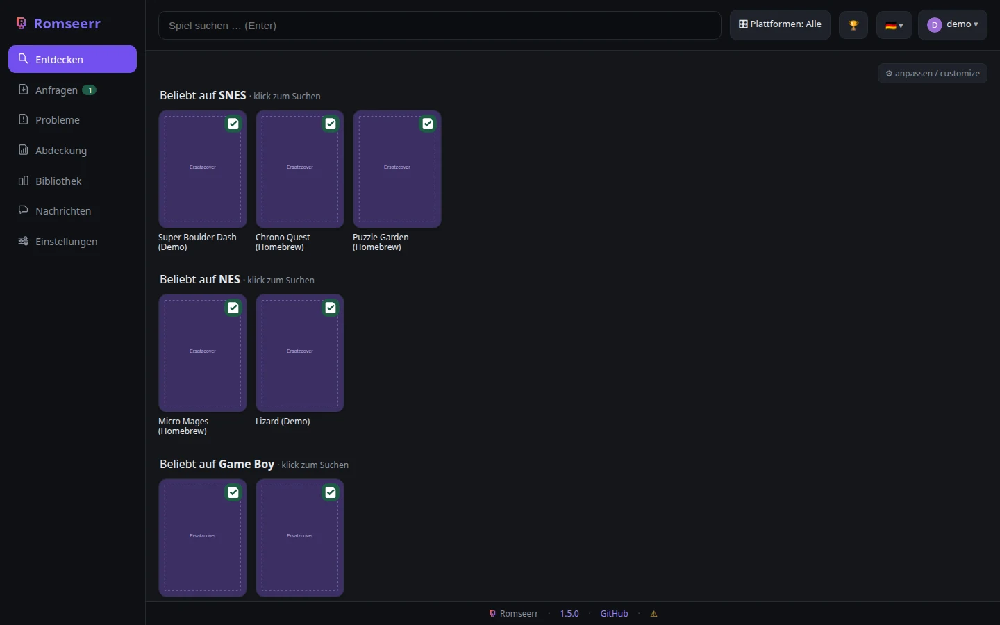 | 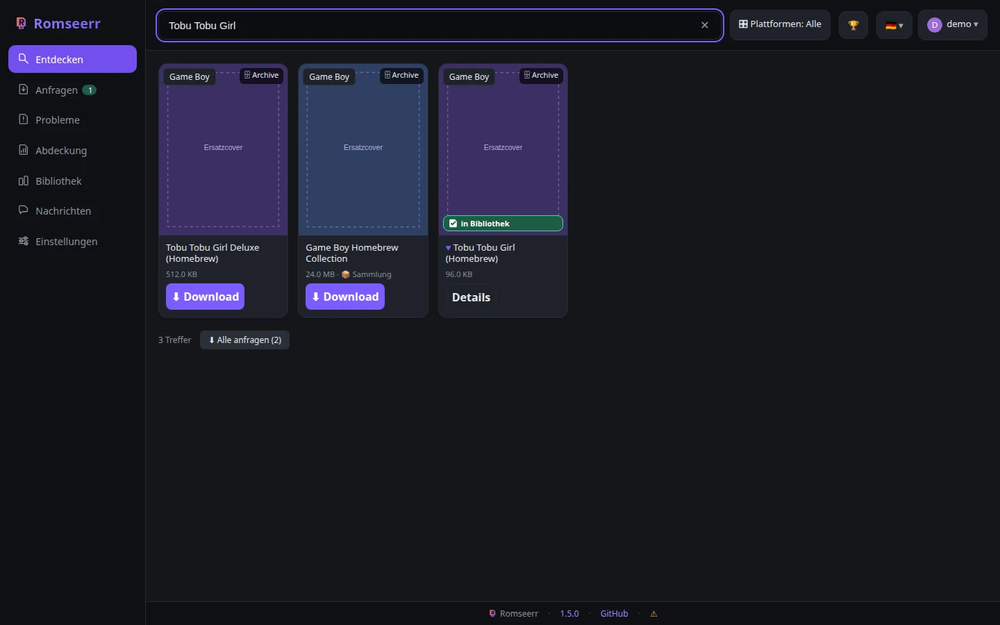 |
| **Detailkarte** — Fassungen und Quellen, Bewertung, Spielen und Streamen | **Anfragen** — Freigabelauf mit Zustand je Auftrag |
| 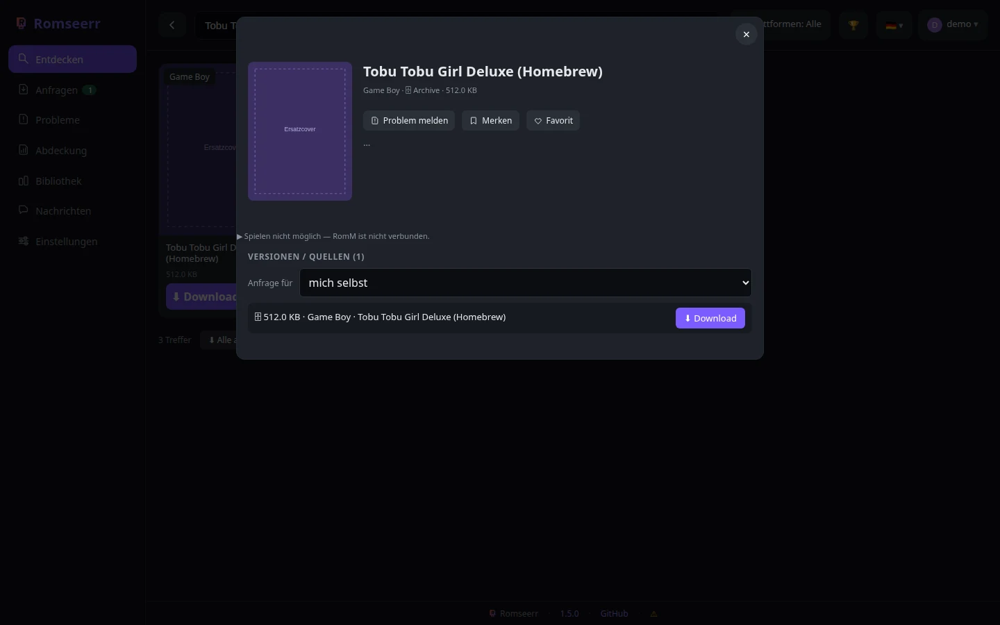 | 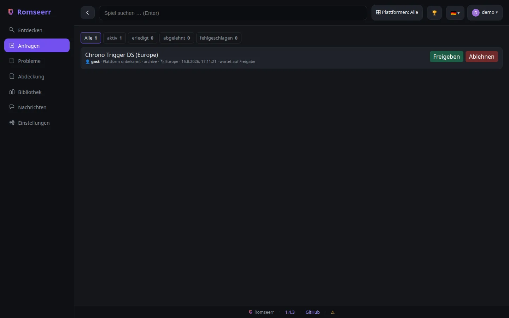 |
| **Bibliothek** — was tatsächlich da ist, nach Hersteller und System | **Abdeckung** — die Gegenfrage: was fehlt |
| 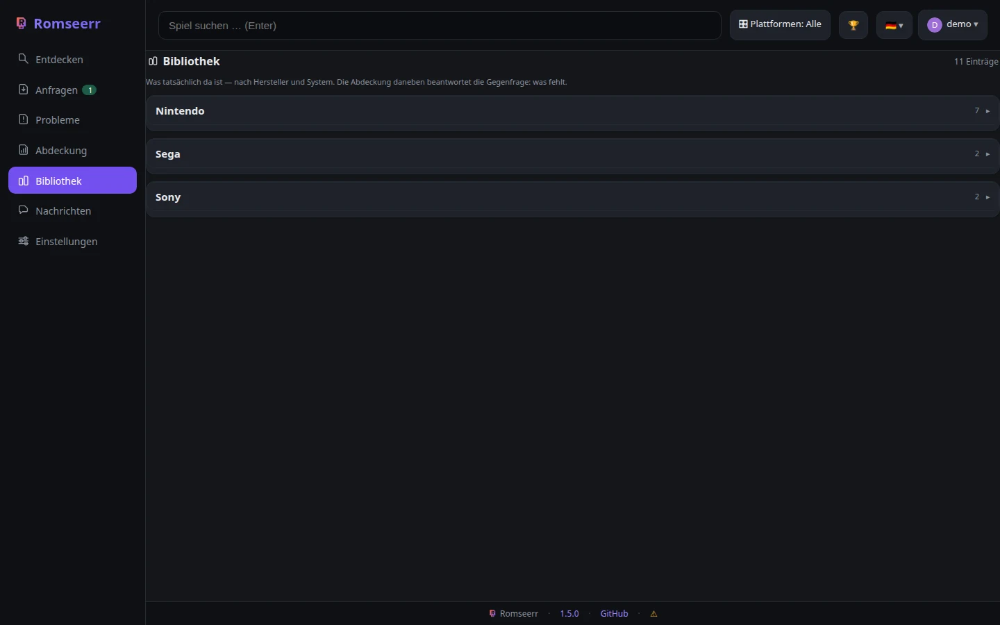 | 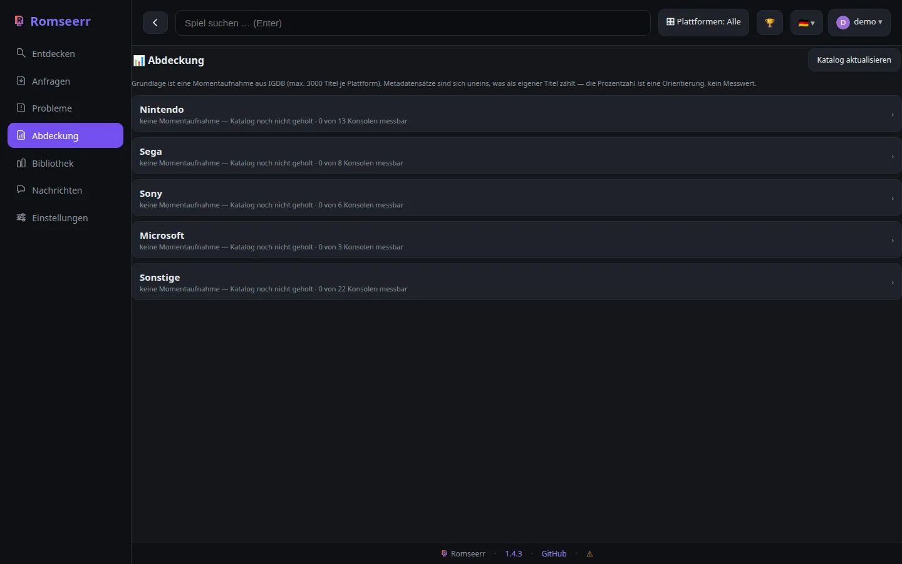 |
| **Einstellungen** — Verbindungen, Dienste, Wartung | **Profil** — Design, Sprache, Benachrichtigungen |
| 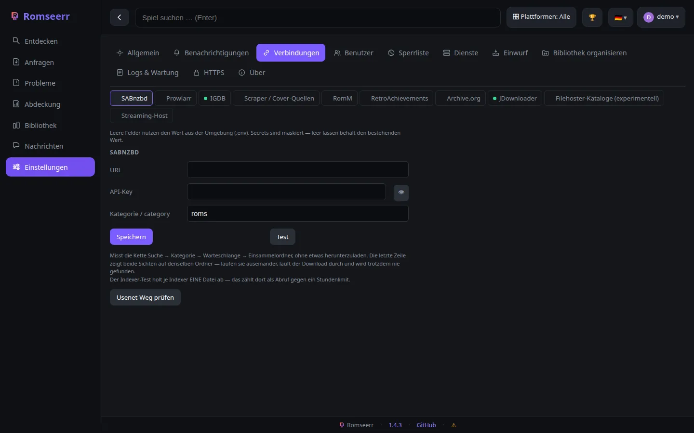 | 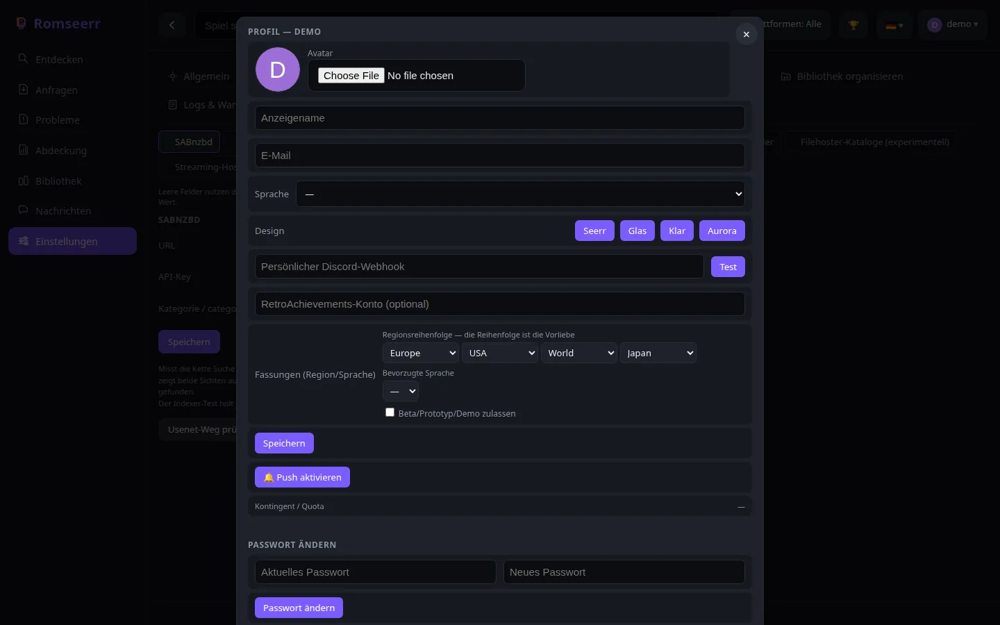 |

### Auf dem Telefon

Romseerr ist eine PWA und wird unter 680 px anders aufgebaut: Die Navigation wandert nach
oben, das Raster wird schmaler.

| Entdecken | Suche | Bibliothek |
|---|---|---|
| 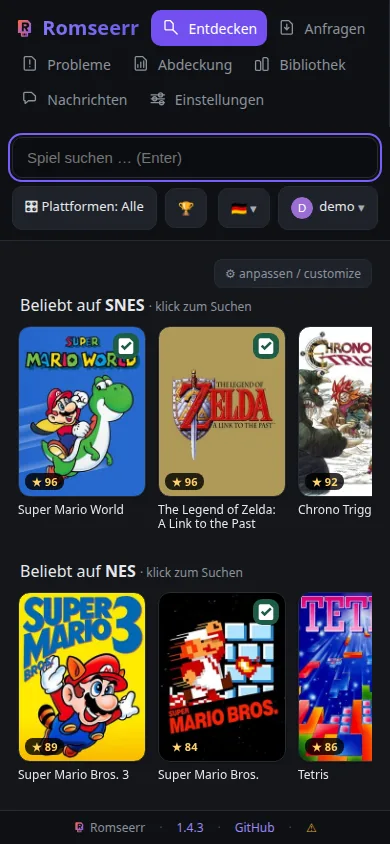 | 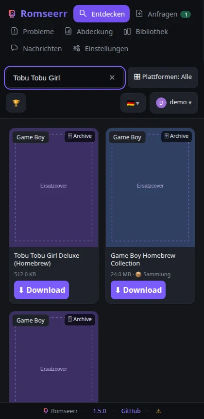 | 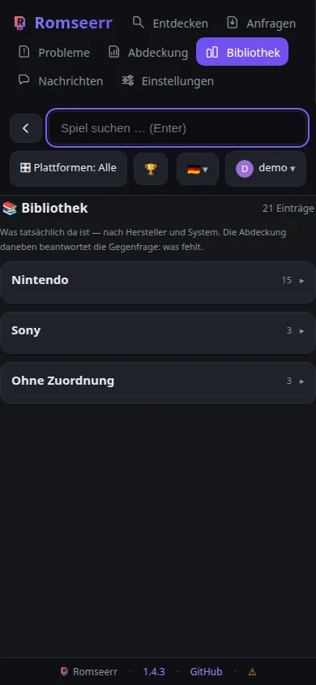 |

### Erster Start

| Anmeldung | Einführungstour |
|---|---|
| 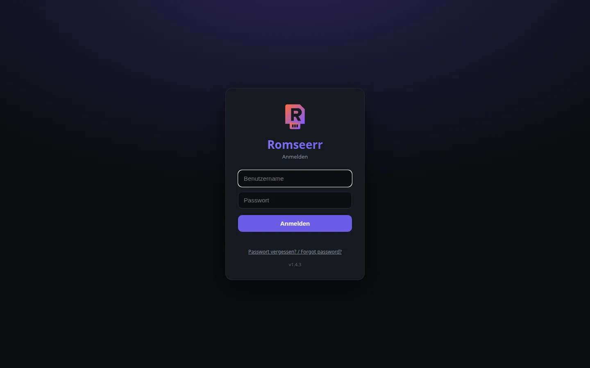 | 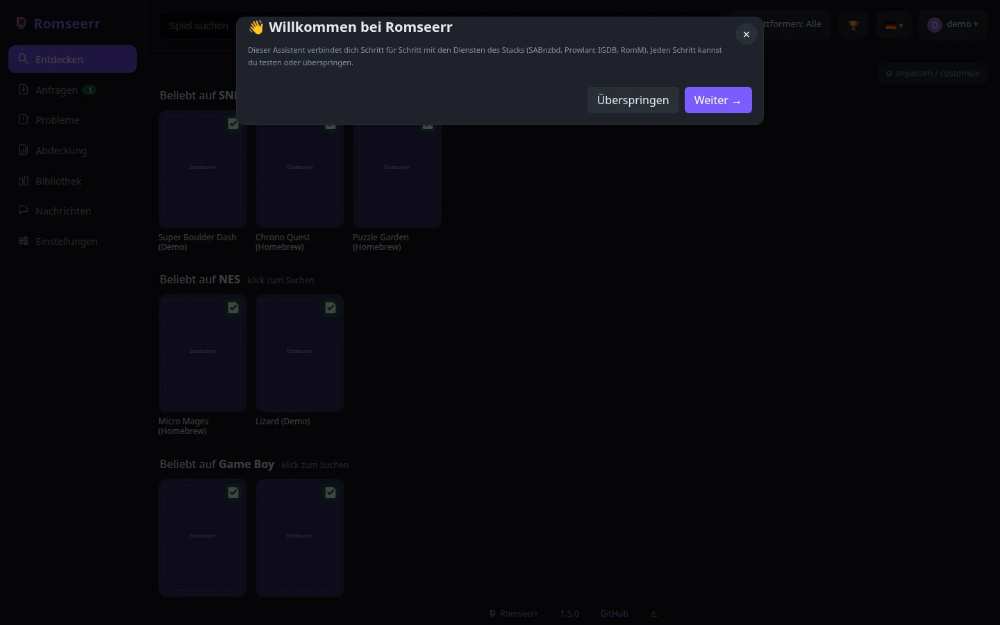 |

---

## Funktionen im Detail

### Suchen & Entdecken
- **Startseite** mit Reihen „Beliebt auf «Konsole»" und je Genre (IGDB), plus einer
  personalisierten Reihe **„Weil du … angefragt hast"** aus der eigenen Anfrage-Historie.
- **Suche** über zwei Quellen gleichzeitig: **Archive.org** (Retro, direkter Download) und
  **Usenet** (Prowlarr-Indexer → SABnzbd, v. a. moderne Konsolen). **Plattform-Vorauswahl**
  grenzt die Suche ein; eine reine Retro-Auswahl schaltet Usenet aus.
- **Eine ausgefallene Quelle sagt es.** Fällt eine der Quellen aus, liefert sie ihren
  letzten bekannten Stand statt „keine Treffer" — und über der Liste steht, dass das ein
  alter Stand ist und wie alt. War nichts gemerkt, wird die Quelle trotzdem genannt: eine
  kurze Liste ist sonst nicht von „es gibt nichts" zu unterscheiden. Ist alles frisch,
  steht dort **nichts** — kein Dauerbanner.
- **Dedup** gegen die bestehende Bibliothek: vorhandene Titel werden markiert und ans Ende
  sortiert; ein erneuter Download wird server- und clientseitig verhindert.
  Verglichen wird ein **normalisierter Schlüssel**, nicht der Dateiname — Endung, Klammern,
  Region und Versionsnummern fallen weg. Dazu gehört seit #615 das **Kürzel der
  Release-Gruppe** am Namensende (`…NSW-SUXXORS`, `….NSW.NiiNTENDO`) und der **Apostroph**
  (`O'Clock` = `OClock`) sowie **Akzente**, die auf ihren Grundbuchstaben abgebildet werden
  (`Pokémon` = `Pokemon`, `Fußball` = `Fussball`; #618). Ohne all das galt dasselbe Spiel als
  zwei Spiele:
  drei Titel lagen bitgleich doppelt in der Bibliothek, 26 GB. Die Regel greift bewusst nur
  direkt hinter einem Plattform-Token und nur bei Kürzeln in Szene-Schreibweise, damit
  `Bomberman 64 - Arcade Edition` nicht mit `Bomberman 64` verschmilzt.
  Umgekehrt wird als **Endung nur abgeschnitten, was auch eine ist** (#617): `splitext()`
  hielt alles hinter dem letzten Punkt dafür und löschte damit echten Titeltext —
  `R.B.I. Baseball` wurde zu `R.B.I`, `Vol. 3` zu `Vol`. **1.307 Titelgruppen mit 5.401
  Dateien** trugen dadurch denselben Schlüssel, und ein fehlender Band galt als vorhanden.
- **Was dieser Stack nicht bedient, taucht nicht auf.** PS5- und Xbox-Series-Releases
  werden verworfen, statt einer Plattform zugeschlagen zu werden (#607). Der Grund ist
  konkret: Die Titelerkennung kannte `PS5` nicht, lieferte `None` — und dann gewinnt die
  Kategorie des Indexers. Drei der vier „Switch"-Treffer für *Resident Evil 4* waren so
  PS5, der größte **62 GB**. Das ist ausdrücklich etwas anderes als eine zu grobe Kategorie
  (Wii U fährt unter Wii mit, #452): Für PS5 gibt es hier keinen Ordner, keinen Emulator
  und keinen Importweg, ein solcher Treffer ist also **nie** richtig. Verworfene Treffer
  stehen im Protokoll — eine Suche, die still weniger liefert, wäre nicht deutbar.
  Seit #616 gilt dasselbe für **modernen PC und Mobil** (`Windows`, `Linux`, `macOS`,
  `Android`, `APK`, `GOG`, `Steam`): 21 von 26 Treffern für *Cyberpunk 2077* kamen ohne
  Plattform zurück, waren anforderbar und landeten mangels Zielordner in `.unsortiert`.
  Was danach **immer noch keine Plattform hat**, wird weder geraten noch verworfen, sondern
  **benannt**: Die Karte zeigt „⚠ Plattform unbekannt" mit dem Hinweis, dass der Titel beim
  Import in `.unsortiert` landet und von Hand einsortiert werden muss (#621). Raten wäre
  schlechter als schweigen — an 1.217 Treffern gemessen ließen sich nur 19 eindeutig über
  den Index auflösen, und davon mehrere **falsch**: `FINAL FANTASY VII (STEAM VERSION)`
  bekäme `nes`, weil zufällig ein NES-Hack im Index liegt.
  Der **Retro-PC bleibt bedient** — `dos` (5.903 Titel, Kern `dosbox_pure`) und `scummvm`
  haben eigene Muster, die davor greifen. Und `PC Engine` ist TurboGrafx-16: Das Muster
  schließt `pc-fx`, `pc-8800`, `pc-9800`, `pc-booter` und `pc-jr` ausdrücklich aus, sonst
  hätte es echte Plattformen dieser Bibliothek verworfen.
- **Cover** über IGDB (SteamGridDB als Fallback), für Usenet-Treffer lazy nachgeladen.

### Detailseite
- Cover, Beschreibung, Wertung, Jahr, Entwickler, Genres, **Screenshots**, **ähnliche Spiele**
  und die **Spielreihe/Collection** (Klick startet die Suche), Versionen/Quellen und Dateiliste.
- Direkt von hier: anfragen, **auf die Wunschliste setzen** oder ein **Problem melden**.

### Bibliothek — was tatsächlich da ist

Die Abdeckung beantwortet „was fehlt". Vor dem Regal steht aber meist die andere Frage:
**was habe ich für diese Konsole?** Dafür gibt es den Menüpunkt **Bibliothek**, nach
**Hersteller** und **System** gruppiert.

Die Einteilung ist hier bewusst **eine andere als beim Plattformfilter**. Der Filter
kommt mit fünf kurzen Gruppen und einem Sammeltopf „Sonstige" aus — man setzt dort ohnehin
einzelne Haken. Eine Ansicht, die „nach Hersteller" ordnet, darf das nicht: Mit der
Filterliste landeten hier **74 % aller Titel** in „Sonstige" oder in einer Gruppe ohne
Namen, und **Commodore — mit rund 40.000 Titeln größer als Nintendo** — hatte gar keine.
Jetzt stehen Commodore, Sinclair, Amstrad, Atari, NEC, SNK, Sharp und Bandai für sich;
DOS, ScummVM und Arcade sind keine Hersteller und haben eine eigene Gruppe. Was übrig
bleibt, heißt „Ohne Zuordnung" — nie ein Gedankenstrich. Ein Klick auf ein System öffnet die Titel, mit
Filter und seitenweise: `c64` und ScummVM halten hier fünfstellige Titelzahlen, eine
vollständige Liste würde den Browser anhalten.

**Plattformen ohne Katalogquelle erscheinen hier ebenfalls.** Für sie lässt sich keine
Prozentzahl berechnen — was man besitzt, weiß Romseerr aber auch ohne IGDB, und sie
deshalb wegzulassen wäre derselbe Fehler, den die Abdeckungsseite gerade vermeidet.

Angezeigt wird der **kürzeste Dateiname** eines Titels: `Turrican` statt
`Turrican (1990)(Rainbow Arts)[cr ABC][t +3]`. Die Titel selbst sind intern normalisiert
(kleingeschrieben, entkernt) — als Liste wäre das unlesbar.

Auch als API: `GET /api/library/platforms` und `GET /api/library/<slug>/titles`
(`offset`, `limit`, `q`) — das Gegenstück zu `…/missing`.

### Abdeckung

Die Seite ist nach **Hersteller** gruppiert (Nintendo, Sega, Sony, Microsoft, Sonstige) —
dieselbe Einteilung wie der Plattformfilter, nicht eine zweite Liste. Eine Herstellerkarte
klappt ihre Konsolen auf, jede mit Quelle und Stand wie bisher.

Die Zahl auf der Herstellerkarte ist **Summe besessen ÷ Summe bekannt**, nicht das Mittel
der Prozente — sonst zählte der Virtual Boy (16 Titel) so viel wie die SNES (2825). Die
Methode steht als `Σ` auf der Karte. Und weil **nicht jede Plattform eine Katalogquelle
hat**, steht dort auch „x von y Konsolen messbar": eine Zahl über einen Ausschnitt, ohne
das dazuzusagen, wäre irreführend.

**Versteckte Ordner sind keine Plattformen.** Was mit einem Punkt beginnt, gehört einem
Werkzeug und nicht der Bibliothek. Das Werkzeug, das die Bibliothek umsortiert, legt sein
Arbeitsverzeichnis als `.umbau` neben die Plattformordner — dessen Protokolldateien
erschienen vorher als eigene „Plattform" mit 62 Titeln. Dieselbe Regel fängt `.cache`,
`.stfolder` und die Ordner von Synchronisationsdiensten gleich mit ab.

**Die Ansicht lässt sich mit der Tastatur bedienen.** Herstellergruppen und Systemzeilen
sind Knöpfe, keine anklickbaren Flächen: Sie stehen in der Tab-Reihenfolge, tragen einen
vorlesbaren Namen samt Titelzahl, und eine aufgeklappte Gruppe sagt das über
`aria-expanded` auch an.

**Symlink-Platzhalter zählen nicht als Titel.** Legt die Bibliothek auf einem Dateisystem
ohne echte Symlinks (Netatalk, Samba) Verweise im **XSym**-Format ab, sind das über die
Freigabe gelesen ganz normale Dateien. Ohne Gegenmaßnahme werden daraus Titel, aus reinen
Gruppierungsordnern wie `nec/` oder `sega/` werden Plattformen — und die Abdeckung meldet
Lücken, die es nie gab. Erkannt wird das am Inhalt (genau 1067 Byte, Kopfwort `XSym`),
**nicht am Ordnernamen**: in einer anderen Bibliothek liegen unter `sega/` echte Spiele.

### Logos — bewusst keine im Repo

Konsolen- und Herstellerlogos sind **Marken**. Romseerr liefert deshalb **kein einziges
Bild mit**. Wer welche zeigen will, legt sie selbst ab:

```
<config>/logos/snes.png        # Dateiname = Plattform-Slug
<config>/logos/nintendo.svg    # oder Herstellergruppe, kleingeschrieben
```

Erlaubt sind `png`, `svg`, `webp`, `jpg`. Liegt keine Datei da, steht der **Name** dort —
das ist der Normalfall und vollständig so, kein Notbehelf.

### Anfragen & Download
- **Im Browser spielbar** ist eine Plattform nur, wenn RomMs Player den Kern wirklich
  mitbringt. *Einstellungen → Dienste* prüft das je Plattform gegen die laufende
  Installation, statt sich auf eine Liste zu verlassen.
- **Es bleibt immer ein Admin übrig**: Änderungen, die den letzten Zugang entfernen würden,
  werden abgewiesen — beim Löschen wie beim Rollenwechsel.
- **Anfrage-Workflow**: Nutzer mit Auto-Freigabe laden sofort; sonst muss ein Admin freigeben.
- **Erneut versuchen wechselt die Quelle** — ab dem dritten Versuch nimmt Romseerr eine andere
  Quelle statt derselben. Der Eintrag zeigt den Versuch, der Knopf kündigt den Wechsel an, und
  wenn keine Quelle mehr übrig ist, sagt Romseerr das, statt es noch einmal zu probieren.
- **Abgeschlossene Anfragen entfernen** — einzeln über 🗑 oder als Gruppe („Angezeigte
  entfernen“ am aktiven Filter). Laufende Anfragen lassen sich nicht löschen. Fehlgeschlagene
  zählen sonst dauerhaft im Zähler mit. Liegt noch ein Download dazu, fragt Romseerr, ob die
  Dateien mit sollen — bleiben sie liegen, sagt es das ausdrücklich.
- **Sammel-Anfrage** („Alle anfragen") fordert alle noch nicht vorhandenen Treffer auf einmal an.
- **Anfrage im Namen eines anderen Nutzers** (für Admins).
- **Wunschliste**: Titel vormerken, auch wenn es noch keine Quelle gibt — ein Hintergrund-Worker
  sucht periodisch nach und lädt automatisch, sobald etwas Passendes auftaucht (strenger
  Titel-Abgleich gegen Fehlgriffe). Die Liste lässt sich auch **aus einer Liste oder Datei
  einspielen** (TXT/CSV, ein Titel je Zeile, optional `Titel;Plattform`) — mit **Vorschau**
  vor dem Schreiben: getroffen / mehrdeutig / nicht gefunden. Eine **Beispieldatei** im
  erwarteten Format gibt es im Dialog (bzw. unter `/api/wishlist/example.csv`).
- 📺 **Stream** für die Plattformen, die der Browser **nicht** emulieren kann (PS2, GameCube,
  Wii, Switch): der Emulator läuft auf einem Streaming-Host, der Browser bekommt Bild und Ton.
  Romseerr emuliert nichts und liefert weder Emulator noch Firmware aus — es löst einen Titel
  auf eine Datei auf und bittet den Host, sie zu starten. **Einzelplatz**: eine Sitzung
  gleichzeitig, mit Namen des Belegers, Ablauf und ausdrücklichem Beenden. Liegt derselbe
  Titel auf **mehreren** Plattformen, rät Romseerr nicht, sondern fragt: die Kandidaten
  stehen als Knöpfe da. Der schlanke
  komplette Streaming-Host liegt als **`contrib/streaming-host/`** bei (Compose,
  Init-Skripte, Start-Dienst, Doku) und ist ohne fremde Umgebung nachbaubar.
  **3DS: die Absage kommt vor der Zusage.** Ein verschlüsseltes Abbild und eine `.cia`
  starten beide nicht — aber aus verschiedenen Gründen, und beides steht jetzt dran,
  **bevor** ein Platz belegt wird. Vorher meldete Romseerr „streambar", der Nutzer klickte,
  nahm einen Platz und wartete auf ein Bild, das nie kam. *Verschlüsselt* betrifft diesen
  Titel, so wie er vorliegt; *`.cia`* betrifft das Format, immer — auch entschlüsselt
  starten Installationspakete nicht direkt. Im Zweifel wird durchgelassen: ein Abbild ohne
  lesbaren NCSD-Kopf ist nicht beurteilbar, und eine falsche Absage kostet mehr als ein
  Fehlversuch.
  **Switch: Updates und DLC sind keine Spiele.** Von 434 Dateien unter `switch/` sind
  **110 Updates und 58 Zusatzinhalte** — 39 % waren Startknöpfe, die nicht starten können.
  Entschieden wird an den letzten drei Stellen der Titel-ID (`000` Spiel, `800` Update, ab
  `001` DLC), und die steht **im Archiv**: im Namen des Tickets `<rights-id>.tik` im
  PFS0-Inhaltsverzeichnis, unverschlüsselt und ohne Schlüssel lesbar. Der Dateiname taugt
  nicht — im Bestand steht „DLC" mal als `[DLC]`, mal als `[space scout pack dlc]`, und
  `[Trowzer's Top Tonic Pack]` trägt gar keinen Hinweis und ist trotzdem einer. Eine XCI
  und ein Archiv ohne Ticket gehen weiterhin durch: Eine falsche Absage kostet mehr als
  ein Fehlversuch.
  **Was die Datei ist, sagt ihr Inhalt — nicht ihr Name.** In dieser Bibliothek liegt ein
  „Save Data Transfer Tool", das `.3ds` heißt und eine `.cia` **ist**: Kopfgröße `0x2020`,
  Zertifikatskette, Ticket, TMD, und bei `0x100` kein `NCSD`. Nach der Endung beurteilt fiel
  es genau in die Regel „nicht beurteilbar, also durchlassen" — und wurde als startbar
  angeboten. Von 1.249 Abbildern war es das einzige; die Zahl stimmte, der Schluss nicht.
  Jetzt entscheidet die Kennung im Kopf, in **beide** Richtungen: Ein Abbild, das
  fälschlich `.cia` heißt, würde sonst als „unlesbare CIA" abgewiesen, obwohl es einwandfrei
  läuft — und eine falsche Absage ist hier der teure Fehler. Was sich weder als das eine
  noch als das andere zu erkennen gibt, geht weiterhin durch: Die Erkennung fügt Wissen
  hinzu, keine Absagen.
  **Verschlüsselt ist kein Endzustand mehr, wenn der Host entschlüsseln kann.** Azahar
  spielt nur entschlüsselte Dumps und entschlüsselt nicht selbst; von 1.249 gemessenen
  Abbildern dieser Bibliothek waren 1.248 verschlüsselt — ohne diesen Schritt bleibt die
  Plattform leer. Der Streaming-Host bringt das Werkzeug deshalb selbst mit
  (`init/23-3ds-entschluesseln`) und entschlüsselt **beim Start, in einen Zwischenspeicher
  daneben** — gemessen 0,07 s für ein 128-MB-Abbild, die Zeit steckt im Kopieren. Romseerr fragt die Fähigkeit ab und wandelt
  die Absage dann in eine Zusage mit angekündigter Wartezeit (`will_decrypt`); antwortet
  der Host nicht, bleibt es bei der Absage — eine Zusage, die er nicht halten kann, fiele
  erst nach dem Belegen eines Platzes auf.
  **`.cia` wird installiert statt abgewiesen.** Eine CIA startet nie direkt — aber Azahar
  kann sie installieren, und danach startet der installierte Titel. Was wirklich
  entscheidet, ist die **Art des Pakets**, und die steht in der Titel-ID, nicht im
  Dateinamen: Von 25 CIAs dieser Bibliothek sind 13 Updates und 2 DLC, die auch installiert
  nie starten; bei zweien log der Dateiname, die Titel-ID nie. Romseerr sagt deshalb je nach
  Art unterschiedlich ab (`cia_update`, `cia_dlc`) — und nur dann zu, wenn der Host laut
  `can_install_cia` auch installieren kann. Anders als beim Abbild wird eine **unlesbare
  CIA abgewiesen** statt durchgelassen: Eine CIA muss eine Titelkopfstruktur haben, ihr
  Fehlen ist ein Defekt und kein Sonderfall.
  **Warum daneben und nicht an Ort und Stelle:** *das verschlüsselte Original ist es, was
  den Titel identifizierbar macht.* Von 20 3DS-Titeln erkannte Hasheous 15 an ihrer
  Prüfsumme — die beste Quote der ganzen Bibliothek, und mit ihr fielen die Metadaten weg,
  würde man die Dateien ersetzen. Der Zwischenspeicher hat einen Deckel
  (`DECRYPT_3DS_CACHE_GB`, Standard 50) und verdrängt nach letzter Nutzung.
  **Ton und Gamepad brauchen dort HTTPS** — über HTTP verweigert der Browser die
  WebCodecs-API, und beides bleibt still, ohne dass ein Fehler erscheint.
  Liegen zu einem Titel **mehrere Dateien** vor — Basisspiel, Update, DLC —, wählt
  Romseerr das Basisspiel: **die Titel-ID entscheidet**, bei Switch die letzten drei
  Stellen (`000` Basis, `800` Update, sonst DLC). Erst wenn keine Titel-ID im Namen
  steht, zählt die Größe. Wichtig ist die Reihenfolge: eine Basis mit eingespieltem
  Update trägt eine Fassungsnummer > 0 und sähe sonst wie ein Update aus. Startet man
  ein Update allein, meldet der Emulator nur `Error while loading ROM!` — von außen
  ununterscheidbar davon, dass er die Plattform nicht beherrscht.
- 🎮 **Wii U, PS Vita und Xbox können jetzt importieren.** `.wux`, `.wud`, `.wua` und
  `.rpx` (Wii U), `.vpk` (Vita) und `.xbe` (Xbox) fehlten in der Endungsliste — und ohne
  sie konnte **kein einziger Titel** dieser Plattformen in die Bibliothek gelangen. Ein
  5,5-GB-Download endete mit „1 Nicht-ROM übersprungen". Dass Wii U nie funktionierte, sah
  jahrelang aus wie ein fehlender Titel und war eine fehlende Zeile.
- 🔑 **Archive.org-Konto per Schlüsselpaar, nicht per Passwort.** Unter *Einstellungen →
  Verbindungen → Archive.org* nimmt Romseerr Access- und Secret-Key von
  `archive.org/account/s3.php` entgegen und schickt sie als Kopfzeile mit
  (`Authorization: LOW …`). Das ist einzeln widerrufbar, hat keine Sitzung, die nachts
  still abläuft, und das Kontopasswort bleibt außen vor. Mit hinterlegten Schlüsseln
  verschwindet das Schloss an gesperrten Treffern — sie sind dann ja ladbar. **Ohne**
  Schlüssel wird ein gesperrter Titel gar nicht erst eingereiht, sondern sofort mit Grund
  abgelehnt.
- 📥 **Massenimport aus einem Einwurfordner.** Dateien per SMB in den Share legen —
  Romseerr sieht alle 5 Minuten nach und sortiert ein, was sich bestimmen lässt. Eine Datei
  wird erst angefasst, wenn Größe **und** Änderungszeit seit dem letzten Durchlauf gleich
  geblieben sind: Über SMB dauert eine 5-GB-Kopie Minuten, und ein halb kopiertes Abbild
  läge sonst als Titel in der Bibliothek und startete nie.
  Was sich **nicht** bestimmen lässt, bleibt liegen — mit Grund. 25 der 82 anerkannten
  Endungen sind mehrdeutig; ein Download bringt seinen Plattform-Hinweis aus der Anfrage
  mit, eine hineingelegte Datei bringt nichts mit. Der Ordnername darf entscheiden, wo die
  Endung es nicht kann.
  Verschoben wird über **Kopieren, Prüfen, dann Löschen**: Einwurfordner und Bibliothek
  liegen auf verschiedenen Dateisystemen, und nichts wird gelöscht, was nicht angekommen
  ist.
  **Was SAB schon lädt, wird nicht zweimal geholt (#609).** Ein Neustart erklärt laufende
  Aufträge für tot — SAB lädt sie aber weiter, und ein Neuversuch übergab dasselbe NZB
  danach ein zweites Mal. Gemessen nach einem Deploy während 13 Downloads: 19
  Warteschlangeneinträge für 13 Aufträge, vier Titel doppelt, 115,6 GB offen statt 66.
  Schlimmer als die doppelte Last war die Folge: SAB hängt bei Namensgleichheit ein `.1`
  an, womit zwei Ordner denselben Präfix tragen — der Import hätte 180 KB statt 853 MB
  nehmen können und Erfolg gemeldet. Vor der Übergabe wird jetzt gefragt.
  Zu sehen und auszulösen ist das alles unter **Einstellungen → Einwurf**: was einsortiert
  wird, was liegen bleibt und **weshalb**, dazu ein Knopf, der nicht auf den Takt wartet.
  Die Liste verschiebt selbst nichts — sie ist der Trockenlauf. Ist kein Ordner eingehängt,
  sagt der Bereich das und nennt den erwarteten Pfad. Ohne diese Ansicht wäre der Ordner
  genau die Blackbox, gegen die er gebaut wurde: Dateien verschwinden oder eben nicht, und
  niemand kann sehen, warum. (Dieselben Angaben liefert `/api/import/status`.)
- 🏷️ **Der interne Auftragsname bleibt draußen (#613).** Besteht ein Release aus einer
  einzigen Datei, benennt SAB sie nach dem Auftrag — und der hieß
  `romseerr_<jid>__<Titel>`. Der Präfix landete damit im Dateinamen der Bibliothek, und
  RomM zeigt Dateinamen als Titel an; elf Dateien trugen ihn, eine davon seit dem Vortag.
  Schwerer wiegt der **Zeitstempel** darin: Zwei Kopien desselben Spiels aus verschiedenen
  Downloads sahen für die Dublettenprüfung wie zwei verschiedene Titel aus. Der Präfix
  bleibt, wo er hingehört — `find_output` findet den fertigen Ordner darüber (#64) —, aber
  nicht mehr im Regal.
- 🔎 **Eine ROM mit falscher Endung wird an ihrer Kennung erkannt (#611).** Ein Release
  nannte seine 6,2-GB-NSP `….hdf` — sonst ein Amiga-Festplattenabbild, und `hdf` steht
  nicht in der Endungsliste. Die Datei begann mit `PFS0`, war also eine tadellose
  Switch-NSP; der Import ging daran vorbei und meldete „keine ROM-Dateien gefunden",
  nachdem er 6,2 GB geholt, entpackt und geprüft hatte. Gibt der Name nichts her, wird
  jetzt in die Datei gesehen — **eng gefasst**: nur bei unbekannter Endung, erst ab 64 MB
  und nur für zwei eindeutige Kennungen (`PFS0` am Anfang, `HEAD` bei `0x100`, hinter der
  RSA-Signatur). Das ist ausdrücklich kein Raten wie bei libmagic (#607), sondern eine
  einzelne Signatur an fester Stelle.
- 🗂️ **Bibliothek organisieren — sehen, was der Umbau gerade tut.** Unter
  **Einstellungen → Bibliothek organisieren** (nur für Verwalter) stehen Fortschritt in
  Prozent, Laufzeit, geschätzte Restzeit und die gerade bearbeitete Plattform, dazu die
  Protokolle mit dem jeweiligen `--zurueck`-Befehl. **Diese Ansicht startet nichts** — sie
  liest.
  Zwei Entscheidungen dahinter, die man der Anzeige nicht ansieht: Der Prozentsatz rechnet
  auf **Dateien**, nicht auf Plattformen (`amiga` allein sind über 270.000 Einträge, `gbc`
  5.548 — eine Plattform-Quote stünde stundenlang still und spränge dann), und der Zustand
  kommt aus `<roms>/.umbau/`, **nicht aus einem Auftragsdatensatz**: Romseerr räumt beim
  Start laufende Aufträge ab (#336), ein Neustart mitten im Umbau würde den Eintrag also
  für tot erklären, während der Umbau weiterläuft. Die Datei schreibt das laufende
  Werkzeug, sie weiß es besser. Fertig, laufend und **abgebrochen** sind drei
  unterschiedliche Auskünfte — ein abgebrochener Lauf hinterlässt weder `fertig` noch
  `aktuell`, und genau deshalb sieht man nach. (Dieselben Angaben liefert
  `/api/library/organize/status`.)
  **Starten geht von hier aus auch** — Testlauf oder echter Lauf, für die ganze Bibliothek
  oder eine Plattform. Der Testlauf fragt nicht nach (er verändert nichts), der echte tut
  es. Ein zweiter Lauf wird abgewiesen, **auch wenn der erste außerhalb gestartet wurde**:
  Geprüft wird dafür die Fortschrittsdatei, nicht nur der eigene Prozess. Anhalten lässt
  sich nur ein Lauf aus dieser Oberfläche — was der Wegwerf-Container gestartet hat, kennt
  dieser Prozess nicht, und die Schaltfläche sagt das.
  **Ein Neustart des Containers bricht einen laufenden Umbau ab.** Das kostet keine
  Arbeit: Das Werkzeug ist wiederaufsetzbar, der nächste Lauf macht dort weiter. Und weil
  die Anzeige ihren Zustand aus der Datei liest, steht danach „abgebrochen" da — nicht
  „läuft", was eine Lüge wäre.
- ⌨️ **Heimcomputer-Formate werden importiert.** `.prg`, `.tap`, `.crt`, `.g64`, `.z80`,
  `.tzx`, `.cdt`, `.adz`, `.a52` und weitere — 16 Formate fehlten in der Endungsliste, und
  damit konnte über Romseerr für C64, VIC-20, ZX Spectrum, CPC, Amiga und Atari 5200
  **nichts ankommen**. Am Bestand gemessen betrifft das **51.118 Dateien**; dass diese
  Plattformen überhaupt Inhalt haben, lag an der RetroNAS-Freigabe.
  `.tap`, `.sna` und `.car` bleiben bewusst **ohne feste Plattform** — `.tap` gibt es auf
  C64 *und* ZX Spectrum. Sie kommen an, die Plattform liefert die Anfrage.
- 📦 **Ein entpacktes Spiel ist EIN Titel, kein Haufen Dateien.** Wo der Titel ein
  Ordner ist — Wii U (`code`+`content`+`meta`), PS3 (`PS3_GAME`), entpackte GameCube-
  Abbilder, Xbox (`default.xbe`) — wandert er als Ganzes in die Bibliothek. Erkannt am
  **Aufbau**, nicht an einer Dateizahl: Ein entpacktes Spiel hat Tausende Dateien, eine
  Sammlung auch, aber der Aufbau ist vom Format vorgegeben.
  Vorher wurde jede Datei einzeln geprüft, und das ging in beide Richtungen schief:
  „14 Datei(en) → 14×wiiu · 170 Nicht-ROM übersprungen" — die 14 waren Bruchstücke aus dem
  Spielinneren, die 170 das Spiel samt ausführbarer Datei.
- 🔗 **Von der Anfrage zur Karte.** Ein Klick auf den Titel einer Anfrage öffnet die
  Detailseite des Spiels. Vorher war der Titel reiner Text — nur die Knöpfe rechts
  reagierten, und wer wissen wollte, worum es geht, musste ihn abtippen. Findet die Suche
  nichts, sagt die Zeile das kurz, statt ein leeres Fenster zu öffnen: Der wahrscheinlichste
  Klick ist der auf eine **fehlgeschlagene** Anfrage, und genau die kann unauffindbar sein.
- 🔒 **Gesperrte Archive.org-Titel sagen es vorher.** Manche Einträge liegen in der
  Sammlung `loggedin` und brauchen ein Konto; ohne eines antwortet der Download mit
  **HTTP 401**. Solche Treffer bleiben sichtbar — es gibt sie ja —, tragen aber ein
  Schloss. Vorher fiel das erst nach dem Klick auf, bei „Mario Kart 8 (Europe)" nach
  5,5 GB, die nie kommen konnten. Und wenn ein Download doch scheitert, steht jetzt der
  **Grund** da statt `returned non-zero exit status 24`.
- 🔎 **Gesucht wird immer an allen Quellen.** Der Plattformfilter wirkt auf das
  *Ergebnis*, nie auf die *Frage*. Vorher entschied eine Tabelle, ob Usenet überhaupt
  befragt wird — und übersetzte damit eine Lücke in der Tabelle in ein fehlendes
  Suchergebnis, was aussieht wie „gibt es nicht". Gemessen: „Wii U" schaltete Usenet ab,
  obwohl sieben Veröffentlichungen dalagen. Der Indexer legt Wii U nämlich unter die
  **Wii**-Kategorien; die Zuordnung am Titel räumt danach auf.
  Ein Treffer **ohne** erkannte Plattform passiert weiterhin jeden Filter — Archive.org-
  Titel tragen oft keine Zuordnung und sind trotzdem gemeint —, steht jetzt aber **hinter**
  den bestätigten. Vorher standen bei Filter `wiiu` sieben unbestimmte Titel oben und der
  erste echte Treffer auf Platz 6.
- 🗂 **Was keine Plattform ist, wird auch keine.** Lässt sich zu einem Titel keine
  Plattform bestimmen, bleibt sie **leer** — Romseerr erfindet keinen Namen. Früher stand
  dort `Mixed`, und weil dieser Wert bis zum Anlegen des Zielordners durchlief, **erzeugte**
  Romseerr daraus eine Plattform: erst den Ordner, dann den Indexeintrag, dann das System in
  der Ansicht. Ein Titel ohne erkennbare Plattform war damit nicht unbeschriftet, sondern
  mit einer Plattform beschriftet, die es nicht gibt. Downloads ohne Plattform landen jetzt
  in `.unsortiert` — der führende Punkt genügt, damit daraus nie ein System wird. Ein
  **vorhandener** `Mixed`-Ordner bleibt unangetastet liegen; er zählt nur nicht mehr als
  Plattform.
- ▶ **Play im Browser**: liegt der Titel in RomM und gibt es für die Plattform einen
  EmulatorJS-Kern, führt ein Knopf auf der Detailseite direkt in RomMs eingebauten Spieler.
  Romseerr emuliert selbst nichts. **PS2, GameCube, Wii, Dreamcast und Switch zeigen den Knopf
  nie** — dafür existiert kein Kern und wird keiner existieren. Jede Absage nennt ihren Grund
  (nicht in der Bibliothek, zu groß für den Browser, keine RomM-Verbindung); BIOS-Bedarf und
  die Romset-Eigenheit von Arcade stehen vorher da, nicht erst vor einem schwarzen Bild.
- 📦 **Filehoster-Weg (experimentell)**: ein generischer **Katalog-JSON-Indexer** im
  verbreiteten Format `{name, downloads:[{title, uris, uploadDate, fileSize}]}`. **Romseerr
  liefert nur den Parser — die Quell-URLs trägt der Betreiber unter Einstellungen →
  Verbindungen ein, im Repo steht keine.** Die URIs werden aufgeteilt: direktes HTTP lädt
  Romseerr selbst, Filehoster gehen als `.crawljob` an JDownloader, `magnet:` bleibt außen vor.
  Kataloge haben eine TTL und zeigen ihren Stand — Linkfäule ist hier der Normalfall, und ein
  toter Link endet als klarer Job-Fehler statt als Dauerhänger.
- **Anfrage-Verlauf** je Nutzer mit Zeitstempel (für Admins pro Nutzer filterbar), inklusive
  der **gelieferten Fassung**.
- 🏷 **Fassungen (Region/Revision/Sprache)**: Romseerr liest die üblichen Namenskonventionen
  (No-Intro, Redump, TOSEC, GoodTools) und gruppiert die Kandidaten auf der Detailseite nach
  Fassung statt roher Release-Namen. **Voreinstellung je Nutzer** (Regionsreihenfolge,
  bevorzugte Sprache, Beta/Prototyp zulassen) mit **instanzweitem Rückfall** in den
  Einstellungen. Region ändert Inhalt (Sprache, Schwierigkeit, Zensur, 50/60 Hz) — das ist
  **keine Qualitätsleiter**, deshalb wird nach der eingestellten Reihenfolge gewählt, nicht
  sortiert. Was im Namen nicht steht, bleibt **unspezifiziert** und wird nie geraten.
- 🏆 **RetroAchievements** auf der Detailseite: Anzahl der Achievements, Punkte und Link zum
  Set; mit hinterlegtem Konto (Profil) zusätzlich der eigene Fortschritt. Dazu ein Suchfilter
  „nur mit Achievements". Rein schmückend — **ohne Key oder bei Ausfall verschwindet der
  Abschnitt, es erscheint kein Fehler.** Die Zuordnung läuft über die vorab geholte Set-Liste
  je Konsole und verlangt einen **exakten** Titeltreffer; mehrdeutige Treffer werden verworfen,
  weil eine falsche Zuordnung schlimmer ist als gar keine.
- 📊 **Abdeckung je Plattform**: „412 von 1.180" — und ein Klick öffnet die **fehlenden**
  Titel (paginiert, filterbar, per Sammelauswahl auf die Wunschliste). Grundlage ist eine
  Momentaufnahme aus IGDB; **Quelle und Stand stehen an jeder Zahl**, denn Metadatensätze
  sind sich uneins, was als eigener Titel zählt. Plattformen ohne Momentaufnahme zeigen das
  an, statt „0 %" zu behaupten.
- **Export/Import der Konfiguration** (Einstellungen → Logs & Wartung): versioniertes JSON mit
  Einstellungen, Benutzern & Rechten, Anfragen und Wunschlisten. Geheimnisse bleiben ohne
  Passphrase draußen, mit Passphrase liegen sie verschlüsselt bei. Beim Import ist
  `Zusammenführen` oder `Ersetzen` ausdrücklich zu wählen.

### Import
- Entpacken mit `unar`, **Plattform-Erkennung** an der Dateiendung, **Dedup** und Einsortierung
  nach `/roms/<plattform>/` (RomM & RetroNAS teilen sich diese Bibliothek), danach optionaler
  **RomM-Scan**. Es werden **nur bekannte ROM-/Disk-Endungen** importiert — Nicht-ROM-Dateien
  (Emulatoren, `.exe`/`.dll`, Assets) werden übersprungen; enthält ein Item keine ROM, endet die
  Anfrage sauber als Fehler statt die Bibliothek zu vermüllen.
- Hängt das Downloadprogramm eine **zweite Endung** an (SABnzbds *deobfuscate* macht aus
  `spiel.nsp` ein `spiel.nsp.hdf`), zählt die vorletzte — die Datei wird importiert und der
  angehängte Suffix beim Kopieren entfernt.
- In **SABnzbd/JDownloader** erscheint der Download unter dem **ROM-Titel**; nach dem Import
  wird der erledigte Download dort **automatisch entfernt**. Nur nach einem **geglückten**
  Import: erkennt Romseerr nichts, bleibt der Download liegen, damit nichts verloren geht und
  die Ursache noch nachsehbar ist. Diese Ordner stehen unter *Einstellungen → Logs & Wartung*
  mit Größe und Alter, lassen sich einzeln oder gesammelt entfernen und verfallen nach einer
  einstellbaren Frist (Standard 14 Tage, `0` schaltet das ab). Ist die Ursache behoben,
  liest **Erneut einlesen** am fehlgeschlagenen Auftrag dieselben Dateien noch einmal ein —
  ohne neuen Download. (*Erneut versuchen* holt dagegen alles neu.)

### Verwaltung
- **Einstellungen** mit Unterbereichen: Allgemein, Benachrichtigungen, Benutzer, Verbindungen,
  Sperrliste, Dienste, Logs & Wartung, HTTPS, Über.
- **Verbindungen** (SABnzbd/Prowlarr/IGDB/RomM …) komplett über die Weboberfläche konfigurierbar,
  Secrets maskiert, Klartext-Anzeige auf Wunsch. Leere Felder fallen auf die `.env`-Werte zurück.
- **Erststart-Assistent**, der beim ersten Aufbau Schritt für Schritt durch die Dienste führt.

---

## So funktioniert eine Anfrage

```
Suche ──► Treffer (Archive / Usenet)
             │  Anfrage (ggf. Admin-Freigabe)
             ▼
   ┌─────────────────────────────────────────────┐
   │ Archive.org  → aria2 lädt direkt             │
   │ Usenet       → SABnzbd lädt die NZB          │
   │ Filehoster*  → .crawljob für JDownloader     │
   └─────────────────────────────────────────────┘
             │  fertige Dateien
             ▼
   Entpacken (unar) → nur ROM-Endungen → Dedup →
   Einsortieren /roms/<plattform>/ → Index (nur diese Plattform)/RomM-Scan →
   „verfügbar" + Benachrichtigung  (Download aus SAB/JD entfernt)
```

\* **Filehoster ist experimentell** (siehe [Projektstatus](#projektstatus) / Issue #63):
der Code-Weg existiert, aber es ist noch keine Quelle verdrahtet, die Filehoster-Treffer liefert.

---

## Der Stack

Romseerr ist nur die **Oberfläche**; die eigentliche Arbeit erledigt der umliegende Stack.
Architektur, Datenfluss und Komponenten sind ausführlich in
**[docs/ARCHITECTURE.md](docs/ARCHITECTURE.md)** beschrieben.

| Dienst | Rolle | Port (Standard) |
|---|---|---|
| **Romseerr** | Such-/Anfrage-Oberfläche, Import, Benachrichtigung | 8770 (HTTP) · 8443 (HTTPS, optional) |
| **SABnzbd** | Usenet-Downloads (Kategorie `roms`) | 8080 |
| **Prowlarr** | Indexer-Suche (nur lesend) | 9696 |
| **JDownloader** | Filehoster-Downloads (experimentell) | 5800 |
| **RomM** (+ MariaDB) | Bibliothek / Browser-Player | 8998 |

Technik: **Python 3.14 · Flask · SQLite · aria2 · unar**. Kein Build-Schritt — das komplette
Frontend liegt als String in `app.py` und wird ohne Bundler ausgeliefert.

---

## Schnellstart

### Kompletter Stack (Romseerr + SABnzbd + Prowlarr + JDownloader + RomM)

```bash
git clone https://github.com/Sparxx947/romseerr.git && cd romseerr
cp .env.example .env          # Pfade, DB-Passwörter, IGDB-Keys … setzen
docker compose up -d --build
# SABnzbd (:8080) und Prowlarr (:9696) einrichten, deren API-Keys in .env eintragen
docker compose up -d          # erneut, damit Romseerr die Keys übernimmt
# Oberfläche: http://<host>:8770  → beim ersten Aufruf Admin anlegen
```

### Nur Romseerr (vorhandener Stack)

Betreibst du SABnzbd/Prowlarr/JDownloader/RomM bereits, brauchst du nur den Dienst
`romseerr` aus `docker-compose.yml` und zeigst dessen `.env`-URLs auf die vorhandenen Hosts.
Alternativ das fertige Image von der GitHub Container Registry:

```bash
docker run -d --name romseerr -p 8770:8770 \
  --env-file .env \
  -v /pfad/zur/rom-bibliothek:/roms \
  -v ./config:/config \
  ghcr.io/sparxx947/romseerr:1.2.0-beta.1
```

> **Nicht `:latest` nehmen, solange es keinen stabilen Release gibt.** Das Tag wird nur für
> stabile Fassungen gesetzt — eine Vorabversion darf es nicht verschieben. Da bisher jeder
> Release eine Beta war, steht `:latest` unverändert auf einem Bau vom **2026-08-07 07:33**
> (`bd87e6c`), also von **vor** v1.0.0-beta.1. Wer ihm folgt, bekommt ein Abbild, das zu
> keinem Release gehört. Nimm die Versionsnummer, bis die erste stabile Fassung erscheint.

Der Container läuft **non-root** und bringt einen **Healthcheck** auf `/health` mit.

> **`/config` muss der uid 1000 gehören** (oder für sie beschreibbar sein) — das ist die
> Kennung, unter der das Abbild läuft. Passt sie nicht, startet Romseerr trotzdem,
> beantwortet jede Anfrage und meldet `healthy`, **speichert aber nichts**: keine Anfrage,
> keinen Job, keine Einstellung. Sichtbar wird das an `"storage": "ro"` in `/health`, einer
> Startwarnung und einem Hinweis in der Oberfläche. Prüfen: `docker exec romseerr id`,
> setzen: `chown -R 1000 ./config`.

> **`/roms` muss für dieselbe uid LESBAR sein — auch jeder Plattformordner einzeln.**
> Ein Ordner, den der Container nicht betreten darf, trägt **null Titel** bei. Das sah
> früher aus wie eine leere Plattform; hier lag ein Ordner auf `drwx-w----` (die Gruppe
> durfte schreiben, aber nicht lesen) und 13.176 Titel fehlten, ohne dass irgendwo etwas
> stand. Der Indexlauf nennt so etwas jetzt beim Namen:
>
> ```
> Bibliotheks-Index: 598 Plattformen, 128177 Titel (in DB gesichert) — 1 Plattform NICHT gelesen: pico8 (PermissionError)
> ```
>
> und `/health` führt es als `lib_failed` samt `lib_failed_platforms`. Ein Wert über `0`
> heißt: **`lib_titles` ist unvollständig.** Prüfen mit
> `docker exec romseerr ls /roms/<ordner>`, setzen mit `chmod 755 /pfad/zu/<ordner>`.

> **Nach einem Import steht eine andere Zeile im Protokoll** (#655). Der volle Lauf über die
> ganze Bibliothek kostete hier gemessen 260,7 s — je Import, auch bei null neuen Dateien.
> Ein Import liest deshalb nur noch die Plattformen neu ein, in die er gelegt hat:
>
> ```
> Bibliotheks-Index aktualisiert: switch (484) — 599 Plattformen, 293068 Titel (in DB gesichert)
> ```
>
> Die genannten Plattformen werden dabei **vollständig** neu gelesen, Löschungen und
> Umbenennungen darin also genauso erfasst wie beim vollen Lauf. Der volle Lauf bleibt
> und läuft weiter alle 600 s im Hintergrund.

---

## Ersteinrichtung

1. **Admin anlegen** — der erste Aufruf zeigt die Ersteinrichtung; danach ist die Registrierung
   geschlossen (weitere Nutzer legt der Admin an).
2. **Assistent** — führt durch die Dienste (SABnzbd, Prowlarr, IGDB, RomM); jeder Schritt lässt
   sich testen oder überspringen. Später jederzeit erneut über *Einstellungen → Über* aufrufbar.
3. **Verbindungen prüfen** — unter *Einstellungen → Verbindungen*; *Dienste* zeigt die Erreichbarkeit.
4. **Usenet-Weg prüfen** — *Einstellungen → Verbindungen → SABnzbd* misst Suche, Kategorie,
   Warteschlange und Einsammelordner einzeln durch, ohne etwas herunterzuladen. Die letzte
   Zeile zeigt Romseerrs und SABnzbds Sicht auf denselben Ordner: laufen sie auseinander,
   läuft der Download durch und wird nie eingesammelt. Eine Stufe je Indexer holt zudem
   **eine** Datei ab und meldet, ob wirklich eine NZB kommt — ein Indexer kann reichlich
   Treffer liefern und auf jede Download-Adresse mit einer HTML-Seite antworten.

---

## Konfiguration

Zwei Wege, die sich ergänzen — **die Weboberfläche hat Vorrang, `.env` ist der Fallback**:

- **Weboberfläche** — *Einstellungen → Verbindungen* (persistiert in SQLite, Secrets maskiert).
- **Umgebungsvariablen** (`.env`, siehe `.env.example`):

| Variable | Zweck |
|---|---|
| `ROMSEERR_CONFIG` | Konfig-/DB-Verzeichnis (Default `/config`) |
| `ROMSEERR_ROMS` | Ziel-Bibliothek (Default `/roms`) |
| `ROMSEERR_HTTPS` | `1` setzt das Session-Cookie auf `Secure` (hinter HTTPS/Proxy) |
| `ROMSEERR_WISH_INTERVAL` | Intervall des Wunschlisten-Workers in Sekunden (Default 1800) |
| `CATALOG_URLS` | Katalog-JSON-Quellen für den Filehoster-Weg (leer = inaktiv, s. u.) |
| `ROMSEERR_CATALOG_TTL` | Auffrischintervall der Kataloge in Sekunden (Default 21600) |
| `ROMSEERR_PLAY_MAX_MB` | Größengrenze für „Im Browser spielen" in MB (Default 2048) |
| `STREAM_URL` / `STREAM_LAUNCH` | Streaming-Host: Browser-URL und optionaler Start-Dienst. Das Token in `STREAM_LAUNCH` muss dem `STREAM_AGENT_TOKEN` des Hosts entsprechen — **Wechsel siehe `contrib/streaming-host/README.md`**, die Reihenfolge entscheidet |
| `ROMSEERR_STREAM_TTL` | Ablauf einer Streaming-Sitzung in Sekunden (Default 7200) |
| `SAB_URL` / `SAB_APIKEY` / `SAB_CAT` | SABnzbd-Anbindung |
| `PROW_URL` / `PROW_APIKEY` / `PROW_CATS` | Prowlarr-Anbindung |
| `IGDB_CLIENT_ID` / `IGDB_CLIENT_SECRET` | IGDB (Cover, Metadaten, Empfehlungen) |
| `ROMM_URL` / `ROMM_USER` / `ROMM_PASS` | RomM-Scan nach dem Import |
| `JD_DL_BASE` | Basis-Zielordner für JDownloader (Filehoster), **aus Sicht des JD-Containers** |
| `JD_WATCH` / `JD_OUT` | Romseerrs Sicht auf Übergabe- und Zielordner (Host-Seite: `JD_WATCH_HOST` / `JD_OUTPUT`, s. u.). `JD_OUT` leer = **aus `JD_DL_BASE` abgeleitet** |

> **JDownloader braucht die FolderWatch-Erweiterung** (*Einstellungen → Extension Modules*).
> Sie gehört nicht zur Grundinstallation; ohne sie wird der Übergabe-Ordner nie gelesen —
> und die Ordnerprüfung merkt davon nichts, weil sie nur die eigene Hälfte betrifft.
> Nachprüfbar über *Einstellungen → Verbindungen → JDownloader → **Übergabe ausprobieren***:
> legt einen wirkungslosen Auftrag ab und schaut, ob ihn jemand abholt.
> Zum Format der `.crawljob` siehe `docs/ARCHITECTURE.md` — `autoStart`/`autoConfirm` sind
> `BooleanStatus` (`TRUE`).
>
> **JDownloader darf im Automatikbetrieb nichts fragen.** Steht *Default On Added Dupes
> Links Action* (oder die Offline-Variante) auf `ASK`, wartet beim ersten wiederholten
> oder toten Link ein **modaler Dialog**, den im Container niemand sieht — und alle
> folgenden Aufträge stauen sich dahinter.

Vollständige Liste und Standardwerte: **`.env.example`**.

### Host-Pfade vs. Romseerrs Sicht

Die letzten Einträge der `.env` (`ROMS_LIB`, `SAB_COMPLETE`, `JD_WATCH_HOST`, `JD_OUTPUT`)
sind **Host-Pfade für die `volumes:` des Compose** — Romseerr sieht sie nie, es sieht nur
die Einhängepunkte `/roms`, `/sab-complete`, `/jd-watch`, `/jd-output`.

Beide Namen dürfen sich deshalb **nicht decken**: `env_file: [.env]` schiebt jeden Eintrag
der `.env` in den Container, und wo ein Host-Pfad denselben Namen trägt wie eine Variable,
die Romseerr als *eigenen* Pfad liest, gewinnt drinnen der Host-Pfad — still.

> **Beim Aktualisieren:** Die Variable hieß bis dahin `JD_WATCH` und traf damit genau auf
> diesen Fall (#377). In der eigenen `.env` **`JD_WATCH=` in `JD_WATCH_HOST=` umbenennen**,
> sonst hängt der Compose den Standardpfad `./data/jdownloader/folderwatch` ein statt des
> eigenen. `docker compose config` zeigt, was tatsächlich eingehängt wird.
>
> Ebenso gilt jetzt `PORT` innen wie außen (`${PORT}:${PORT}`). Vorher stand innen fest
> `8770`: Ein abweichendes `PORT` veröffentlichte einen Port, auf dem niemand lauschte —
> und der Health-Check las dieselbe Variable und meldete trotzdem `healthy`.

---

## Adressen und Verlauf

Jede Ansicht hat eine Adresse, und ein Titel auch:

| Adresse | Ansicht |
|---|---|
| `#/discover` · `#/requests` · `#/settings` | Entdecken · Anfragen · Einstellungen |
| `#/issues` · `#/messages` · `#/coverage` | Probleme · Nachrichten · Abdeckung |
| `#/library` · `#/lists` | Bibliothek · Listen |
| `#/title/<quelle>/<ref>?v=…&t=…&p=…` | Detailfenster über der Ansicht `v` |
| `#/settings/<bereich>/<unterseite>` | z. B. `#/settings/notif/telegram` |

**Die Oberfläche wird gepackt ausgeliefert.** Skripte, Stilvorlagen und SVG werden beim
Start einmal komprimiert und liegen fertig im Speicher — 245 KB werden so zu 79 KB,
**68 % weniger**, ohne Rechenaufwand je Anfrage. Zusammen mit den inhaltsgehashten URLs
(`immutable`) lädt ein wiederkehrender Browser gar nichts nach.

Die Menüpunkte sind **echte Verweise**: Sie stehen in der Tab-Reihenfolge, lassen sich mit
der Tastatur bedienen und in einem neuen Tab öffnen. Der aktive trägt `aria-current`,
damit auch ein Vorleser weiß, wo man ist.

Damit tut der Browser von sich aus das Richtige: **Zurück** kehrt zur vorherigen Ansicht
zurück und schließt ein offenes Detailfenster, statt die Anwendung zu verlassen — auf dem
Telefon *ist* Zurück die Navigation. Ein **Neuladen** kommt dort heraus, wo man war, und
ein **Link** auf einen Titel lässt sich verschicken.

### Karten auf Entdecken und in der Suche

Die oberste Zeile **„Weil du angefragt hast"** schlägt nur Titel vor, die es für eine
Plattform gibt, die diese Instanz bedient. Ohne diesen Filter lieferte IGDB zu einem
Xbox-Titel bereitwillig moderne PC-Spiele — darunter ein unveröffentlichtes, das als
schwarze Kachel ganz oben stand. Ein Vorschlag, der nie einlösbar ist, kostet mehr
Vertrauen als eine kürzere Zeile.


Jede Karte trägt oben links den **Plattformnamen** (»GameCube«, nicht `ngc`) und, wenn
zutreffend, unten ein Zustandsabzeichen:

| Abzeichen | Bedeutung | Aktionsfeld |
|---|---|---|
| ✓ grün | schon in der Bibliothek | *Details* — dort liegen Spielen und Streamen |
| ⏳ gelb | schon angefragt, noch nicht da | abgeschaltet, damit niemand doppelt anfragt |
| keins | weder noch | *Download* |

Das Symbol trägt die Bedeutung, die Farbe verstärkt sie nur — auf einem dunklen Cover
sagt Grün allein einem rot-grün-blinden Menschen nichts. **Nichts wird ausgeblendet:**
Zu wissen, dass ein Titel schon da ist, ist nützlich; er soll nur nicht mehr gelesen
werden müssen.

### Anfragen

**Ein Vorgang, der nicht mehr vorankommt, wird abgebrochen.** Ein Arbeitsfaden, der
*lebt*, aber steht — ein Entpacken auf voller Platte, ein Abruf ohne Zeitlimit — sieht von
außen aus wie einer, der arbeitet. Gemessen wird deshalb **echter Fortschritt**: die Bytes
im Arbeitsverzeichnis des Auftrags, nicht die Zeit seit der letzten Meldung. Ein großer
Download darf Stunden brauchen und wird dabei nicht angetastet, solange die Datei wächst.
Grenzen: 6 h ohne Fortschritt beim Download, 2 h beim Import
(`ROMSEERR_MAX_STILL_DOWNLOAD`, `ROMSEERR_MAX_STILL_IMPORT`).

**Ein Neustart bricht laufende Vorgänge ab — sichtbar.** Download und Import brauchen
einen laufenden Prozess; wird der Container mitten darin ersetzt, ist der Arbeitsfaden
weg. Solche Aufträge werden beim nächsten Start auf **Fehler** gesetzt, mit dem Hinweis,
die Anfrage zu wiederholen. Vorher blieben sie auf „importiere" stehen: der Titel galt
dauerhaft als angefragt, ließ sich nicht erneut anfordern, und sein halbfertiger Ordner
war vor dem Aufräumen geschützt. Wartende und eingereihte Anfragen bleiben unberührt —
die überstehen einen Neustart einwandfrei.


Über der Liste stehen fünf Filter mit **Zahlen** — *Alle*, *aktiv*, *erledigt*,
*abgelehnt*, *fehlgeschlagen* —, und bei mehreren Nutzern zusätzlich der Nutzerfilter;
beide greifen zusammen. Die Seite sagt damit, was sie enthält, ohne dass man sie
durchklickt.

**Abgelehnt ist eine eigene Gruppe**, weder *erledigt* noch *fehlgeschlagen*: Unter
*fehlgeschlagen* würde man nach Defekten suchen und Entscheidungen finden; unter
*erledigt* wäre es zwar richtig einsortiert, aber nicht mehr auffindbar.

In der Navigation trägt *Anfragen* einen **Zähler** der unerledigten Aufträge: laufende
**und** fehlgeschlagene. Ein Fehlschlag fällt bewusst nicht heraus — sonst lernt man,
dass Null „alles gut" heißt, während etwas ungelöst liegen bleibt. Die Farbe trennt beides
(rot bei Fehlern). Bei Null verschwindet der Zähler ganz, und gezählt werden die
**eigenen** Aufträge, auch für Verwalter — sonst stünde dort nie eine Null.

### Bewertungen und Kommentare

Die Karten auf *Entdecken* tragen die **IGDB-Bewertung** — mit Quelle beschriftet, weil
eine nackte Zahl sonst als die eigene gelesen wird. Ohne Wert steht dort nichts.

In der Detailansicht kommt die **eigene** Bewertung dazu (1–5 Sterne, zurücknehmbar) und
ein Kommentarbereich. Bewertet wird der **Titel**, nicht die einzelne Fassung — die
Bibliothek hält mehrere Fassungen desselben Spiels, die Meinung gilt dem Spiel. Und sie
steht **je Person**: „deine Bewertung" vorn, die der anderen daneben. Ein Mittelwert aus
zwei Meinungen sagt weniger als beide nebeneinander.

### Meine Listen

Über das Benutzermenü oben rechts, Adresse `#/lists`. Zwei Listen, die man leicht
verwechselt — und die deshalb getrennt bleiben:

| | Wunschliste | Favoriten |
|---|---|---|
| handelt von | Titeln, die du **nicht** hast | Titeln, die du **hast** |
| Zweck | daran denken, sie zu holen | schnell wiederfinden |
| endet | wenn der Titel eintrifft | nie |

Sie teilen sich **keinen** Speicher: Dass ein Eintrag die Wunschliste beim Eintreffen
verlässt, ist ihr Zweck — ein Favorit, der von selbst verschwindet, wäre ein Fehler. Ein
Titel darf in beiden stehen, in einer oder in keiner. Beides ist **je Benutzer**.

Vorher stand die Wunschliste unter *Anfragen*, hineingezeichnet in dieselbe Seite. Eine
Anfrage ist aber etwas, worauf das System eine Antwort schuldet — mit Zustand, mit Ende,
und für Verwalter über alle Nutzer sichtbar. Eine Wunschliste ist das Gegenteil.

### Fußzeile

Unten am Fenster angeheftet und mittig: Name, **laufende Version** (verlinkt auf ihren
Release), **GitHub** und der **kurze Commit**. Der Commit ist der Teil, der einen
`dev`-Bau von dem Release unterscheidet, dessen Nummer er trägt — beide melden dieselbe
Version. Wurde ein Abbild ohne Bau-Argumente erzeugt, steht dort zusätzlich ⚠.

Damit trägt jeder Bildschirmauszug seinen Stand, ohne dass jemand danach fragen muss.
**Ohne Anmeldung** erscheint nur der Repo-Link: eine Versionsnummer auf der Anmeldeseite
sagt einem Fremden, welche Lücken er nachschlagen kann.

### Kopfleiste

Oben rechts stehen **Sprache** und **Person**: die Sprache als Aufklappmenü (eingeklappt
die Flagge, in der Liste Flagge **und** Eigenname — eine Flagge allein ist ein Land, keine
Sprache), daneben Name und Bild mit einem Menü für *Profil* und *Abmelden*. Beide Menüs
schließen per Klick daneben und mit Escape. Die Seitenleiste trägt nur noch die Navigation.

### Einstellungen

Das Bereichsmenü liegt **oben**, damit die Formulare die volle Breite bekommen — sie
enthalten URLs und Schlüssel. **Benachrichtigungen** und **Verbindungen** haben eine
zweite Zeile mit *einer Seite je Verfahren bzw. Dienst*: Telegram einrichten heißt nicht
mehr, an Discord vorbeizuscrollen. Jeder Eintrag zeigt seinen Stand — gefüllter Punkt
*aktiv*, offener Punkt *eingerichtet, aber aus*, kein Punkt *nicht eingerichtet*.

Gespeichert wird immer nur, was auf der Seite steht; die übrigen Verfahren bleiben
unberührt.

---

## Benutzer, Rollen & Rechte

- **Rollen:** `admin` (alles) und `user`. Zusätzlich **granulare Rechte**:
  `request`, `autoapprove`, `manage_requests`, `manage_users`, `manage_issues`,
  `manage_settings`, `quota_exempt`.
- **Sichtbarkeit:** Nutzer sehen **nur ihre eigenen** Anfragen und Problem-Meldungen;
  wer `manage_requests`/`manage_issues` hat, sieht alle.
- **Kein Rechteausbruch:** Die Admin-Rolle und die privilegierten Rechte
  (`manage_users`/`manage_settings`) darf **nur ein echter Admin** vergeben.
- **Kontingente (Quotas):** X Anfragen je Y Tage, mit Ausnahme-Recht `quota_exempt`.

---

## Benachrichtigungen

In der Oberfläche konfigurierbar (jeweils mit Testknopf):
**Discord**, **Telegram**, **E-Mail (SMTP)**, generischer **Webhook**, **Gotify**, **ntfy**,
**Pushover** sowie **Web-Push** (PWA, benötigt HTTPS). Jeder Nutzer kann zusätzlich einen
**persönlichen Discord-Webhook** hinterlegen. Passwort-Reset läuft per E-Mail.

---

## Designs & Sprachen

- **Designs:** vier wählbare Looks — **Seerr** (dunkel, poliert), **Glas** (Glassmorphism,
  Farbverlauf + Blur), **Klar** (flach, minimal) und **Aurora** (#629): Navigation oben statt
  links, Bühne über den Entdecken-Reihen, Farbverlauf und ein kräftiger Akzent.
  **Der Verlauf liegt bewusst nur dort, wo keine Cover sind** — Bühne, Kopfleiste,
  Leerflächen — und blendet vor der ersten Reihe aus. Die Entdecken-Ansicht ist
  cover-dominiert; ein Verlauf dahinter stellt zwei Farbquellen gegeneinander, und beide
  verlieren. Der Admin setzt den Standard, jeder Nutzer
  wählt im Profil ein eigenes. Eigene Designs lassen sich leicht ergänzen — siehe die Wiki-Seite
  **[Designs / Themes](../../wiki/Designs)**.
- **Sprachen:** Deutsch, Englisch, Französisch, Spanisch, Italienisch (Umschalter in der Seitenleiste).

Dieselbe Ansicht in allen vier Designs:

| Seerr | Glas |
|---|---|
| 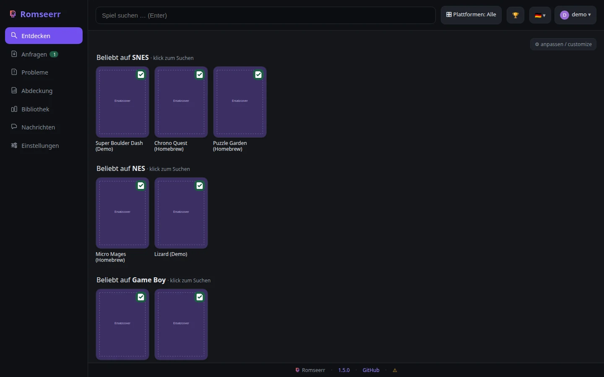 | 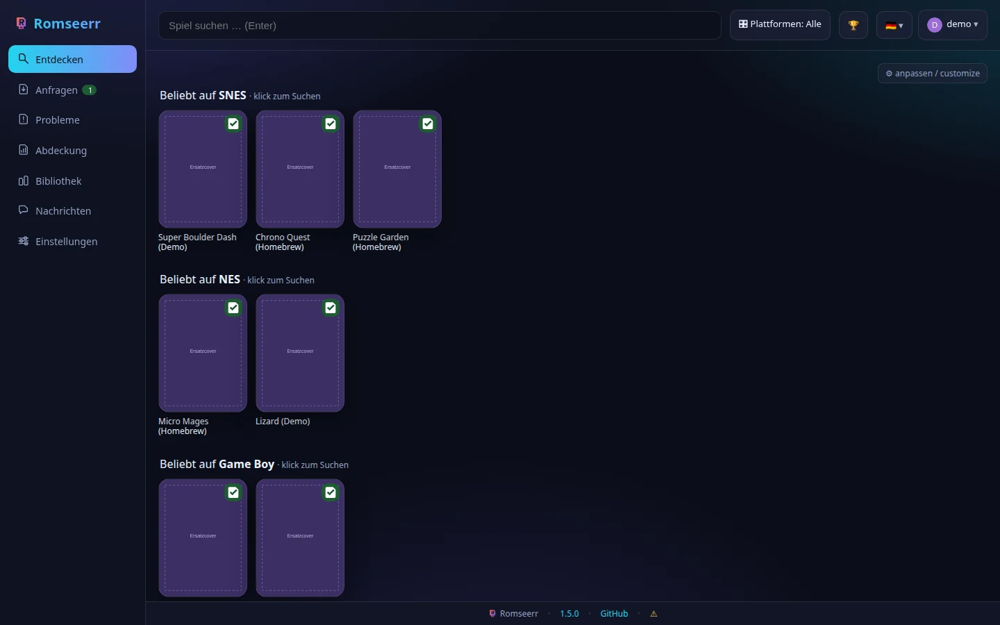 |
| **Klar** | **Aurora** |
| 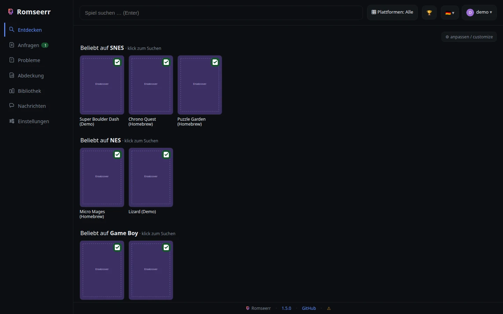 |  |

---

## API

- **Interaktiv:** `http://<host>:8770/api/docs` (Redoc) · **Spec:** `/api/openapi.json`
- **Anleitung + Auth:** [`docs/API.md`](docs/API.md) · **OpenAPI 3.1 im Repo:** [`docs/openapi.yaml`](docs/openapi.yaml)

Programmatischer Zugriff per **API-Key** (Header `X-Api-Key` oder `?apikey=`), admin-äquivalent:

```bash
curl -H "X-Api-Key: $KEY" http://<host>:8770/api/jobs
```

Der Schlüssel wird unter *Einstellungen → Allgemein* erzeugt und kann dort rotiert werden.

**Die Spezifikation nennt auch die Fehlerfälle.** Jede Operation, die eine Anmeldung
verlangt, dokumentiert **401**, jede rechtegebundene zusätzlich **403** — vorher stand dort
nur der Erfolgsfall, und wer sich einen Client daraus erzeugte, behandelte den häufigsten
Fehler überhaupt nicht. Ein Test vergleicht die Spezifikation gegen den laufenden Server,
damit sie nicht wieder auseinanderlaufen.

---

## Versionen: aktualisieren und zurückgehen

*Versions: updating, and going back*

Jeder Release hinterlässt **drei** Dinge, die dasselbe bezeichnen und Verschiedenes können:

| | wofür | änderbar |
|---|---|---|
| Abbild `ghcr.io/sparxx947/romseerr:1.1.0-beta.1` | ein Container, der **zieht** | nein |
| Git-Tag `v1.1.0-beta.1` | ein Bau **aus dem Quelltext** | nein — Tags sind unveränderlich |
| Zweig `release/v1.1.0-beta.1` | ein Bau aus dem Quelltext | **ja** — hierhin darf eine nachgezogene Korrektur |

Alle drei entstehen im selben Lauf: `release-please` erzeugt Tag und Release, spult `main`
vor, legt den Release-Zweig an und **baut das Abbild**. Letzteres hängt bewusst an diesem
Workflow und nicht an einem `on: release`-Auslöser — ein Release, das ein Bot mit dem
Standard-`GITHUB_TOKEN` anlegt, löst keine weiteren Workflows aus, und genau deshalb blieb
v1.1.0-beta.1 ohne Abbild. `latest` bekommt nur eine Version ohne `-` im Namen, also nie
eine Vorabversion.

**Dieselbe Regel gilt für das GitHub-Release.** Ein Release, dessen Version ein `-` trägt,
wird als **Vorabversion** veröffentlicht — `"prerelease": true` in
`release-please-config.json` sorgt dafür, ohne dass jemand daran denken muss. Beide
Bedingungen hängen am selben `-`, und ein Test rechnet sie gegeneinander durch: Ein Abbild
ohne `latest` neben einem Release, das sich `latest` nennt, ist ein Widerspruch. Genau der
stand bis dahin da — zwei der vier Releases waren als stabil veröffentlicht, während das
Register denselben Bauten das Tag `latest` verweigerte.

Das hat eine Folge, die leicht zu übersehen ist: Sind **alle** Releases Vorabversionen,
antwortet `GET /releases/latest` mit **404**. Der Update-Hinweis fragt deshalb bei genau
diesem 404 ein zweites Mal — bei `/releases?per_page=1`, das auch Vorabversionen kennt.
Jeder andere Fehler bleibt ein Fehler und führt zu keiner zweiten Anfrage.

**Und der Vergleich zählt den Vorabteil mit.** Solange jedes Release eine Beta ist, steht
auf beiden Seiten des Vergleichs eine — `1.3.0-beta.1` gegen `1.3.0-beta.2`. Wer nur
`1.3.0` gegen `1.3.0` rechnet, sieht dort nie ein Update, und auch die erste stabile
`1.3.0` bliebe einer laufenden `1.3.0-beta.1` verborgen. Der Vergleich folgt deshalb der
Rangfolge aus SemVer 2.0.0 §11: Zahlenteil zuerst, eine Version **ohne** Vorabteil über
derselben **mit**, und innerhalb des Vorabteils Bezeichner für Bezeichner mit Zahlen als
Zahlen — `beta.10` steht über `beta.9`, obwohl es sich buchstabiert davor einsortieren
würde.

**Der Hinweis verlinkt die Version, die er nennt.** Die Web-Adresse
`<repo>/releases/latest` überspringt Vorabversionen genauso wie der gleichnamige
API-Endpunkt — an fremden Repos nachgemessen: `kubernetes/kubernetes` leitet auf `v1.36.3`
um, obwohl `v1.37.0-rc.0` neuer ist, und ein Repo ohne infrage kommenden Release landet auf
der Übersicht `/releases`, nicht auf einer 404. In einem Projekt, dessen Releases
ausnahmslos Betas sind, führte der Klick also überall hin, nur nicht auf die Fassung, die
der Linktext ausdrücklich nennt. Er zeigt deshalb auf `<repo>/releases/tag/v<version>` —
dasselbe Muster, das die Fußzeile für die laufende Version schon benutzt — und fällt nur
dann auf die Übersicht zurück, wenn gar keine Version bekannt ist.

**Eine andere Version fahren** heißt für einen ziehenden Container: die Marke am Abbild
ändern, mehr nicht.

```yaml
services:
  romseerr:
    image: ghcr.io/sparxx947/romseerr:1.0.0-beta.1   # statt :1.1.0-beta.1
```

`latest` zeigt bewusst **nie** auf ein Pre-Release. Wer Betas will, trägt sie namentlich ein.

**Aus dem Quelltext bauen** — so läuft die Referenzinstallation, und so kommt die Instanz
zu einer belastbaren Auskunft über sich selbst:

```bash
git checkout release/v1.1.0-beta.1        # oder: git checkout v1.1.0-beta.1
docker build -t romseerr:local \
  --build-arg "ROMSEERR_COMMIT=$(git rev-parse --short HEAD)" \
  --build-arg "ROMSEERR_BUILT_AT=$(date -u +%Y-%m-%dT%H:%M:%SZ)" .
```

**Ohne die beiden Argumente** meldet `/api/version` weder Commit noch Bauzeitpunkt, und
die Frage „läuft das, was im Repo steht?" ist wieder Ratesache — genau der Fall, der
einmal einen Arbeitstag gekostet hat. Nach dem Ausrollen prüfen:

```bash
curl -s http://<host>:8770/api/version
{"version":"1.1.0-beta.1","commit":"24a331e","built_at":"…","provenance":"build"}
```

Meldet `provenance` etwas anderes als `build`, wurde ohne diese Angaben gebaut.

**Was ein alter Stand nicht verspricht:** Er ist erreichbar, nicht garantiert lauffähig.
Abhängigkeiten können sich nicht mehr auflösen, und ein einmal migrierter Datenbestand
passt womöglich nicht mehr zu einer älteren Fassung. Vor einem Rücksprung die Daten sichern.

*Every release leaves three things: an image tag for a container that pulls, an immutable
git tag, and a `release/…` branch that can take a backport. Changing the image tag is all
a pulling container needs; `latest` never points at a pre-release. When building from
source, pass `ROMSEERR_COMMIT` and `ROMSEERR_BUILT_AT` — without them `/api/version`
cannot say what it is running. An older state is reachable, not guaranteed to run: back up
the data before going back.*

---


### Downloads über einen Tunnel

Bei Usenet und Filehostern übergibt Romseerr an SABnzbd bzw. JDownloader — dort entscheidet
deren Netzwerk, wie der Verkehr hinausgeht. **Bei Archive.org lädt Romseerr selbst**, mit
`aria2c` im eigenen Container. Die VPN-Konfiguration der Download-Clients wirkt auf diesen
Weg also **nicht**.

`DL_PROXY` (oder *Einstellungen → Verbindungen*) legt einen Proxy für genau diesen Weg fest,
etwa den HTTP-Proxy eines VPN-Containers:

```
DL_PROXY=http://gluetun:8888
```

Der Proxy gilt für **alle** Protokolle. Nur für `http` gesetzt wäre er wirkungslos — die
Dateien kommen über `https`, und das sähe wie Schutz aus, ohne einer zu sein.

**Fail-closed:** Ist ein Proxy gesetzt und nicht nutzbar, **scheitert der Download**. Es
gibt keinen Rückfall auf den direkten Weg. Ein Tunnel, der im Fehlerfall offen fällt, ist
schlechter als keiner — er lädt zu der Annahme ein, geschützt zu sein.

Beim Start wird geprüft, ob der Proxy die **Austrittsadresse tatsächlich ändert**, nicht nur,
ob er antwortet: Ein Proxy, der still direkt weiterleitet, ist erreichbar und nutzlos
zugleich. Das Ergebnis steht in den Startwarnungen; die Adressen selbst werden **nicht**
protokolliert.

## Sicherheit

- **Session-Cookie** signiert, `HttpOnly`, `SameSite=Strict`; `Secure` via `ROMSEERR_HTTPS=1`.
  Der Signierschlüssel wird persistent unter `config/secret.key` gehalten.
  **Lässt er sich nicht speichern, sagt Romseerr es (#587):**

  ```
  Sitzungsschluessel konnte NICHT gespeichert werden (/config/secret.key): PermissionError:
  … — bis das behoben ist, meldet jeder Neustart alle Benutzer ab.
  ```

  Vorher verschwand dieser Fall lautlos, und die Folge war von einem Sitzungsfehler nicht
  zu unterscheiden: Bei jedem Start entstand ein anderer Schlüssel, also waren alle
  Anmeldungen weg — ohne eine Zeile, die auf die Rechte des Konfigverzeichnisses zeigte.
  Auch die **Neuerzeugung im Gutfall** wird protokolliert; beim ersten Start ist sie
  normal, später bedeutet sie, dass die Datei abhandengekommen ist.
- **Login-Rate-Limit** (Fehlversuche je IP+Nutzer im Zeitfenster → HTTP 429).
- **API-Key** wird in konstanter Zeit verglichen.
- **Schlüsselmaterial** (`secret.key`, `vapid.json`) liegt mit `0600`, auch im Altbestand.
  **Das schützt nur die Datei, nicht den Ort:** Steht das Konfigverzeichnis selbst offen —
  bei einem Bind-Mount aus einer Unraid-Freigabe ist `0777` der Normalfall —, kann jeder,
  der dort schreiben darf, die Datei löschen und ersetzen. Die Rechte der Datei allein sind
  also **kein** Beleg dafür, dass der Schlüssel geschützt ist; dafür muss das Verzeichnis
  stimmen. (#589)
- **Keine Secrets im Repo** — `.gitignore` schließt `.env`, `config/` und `*.db*` aus;
  CI prüft mit **Gitleaks**, **Trivy**, **Bandit** und **CodeQL**.
  Zwei Feinheiten, die sonst still danebengehen: Bei `push` und `pull_request` sieht
  Gitleaks **nur die neuen Commits** — die volle Historie prüft allein der wöchentliche
  Lauf. Und ein **geplanter Lauf startet immer auf dem Standardzweig**, hier dem
  Release-Zweig `main`; er würde also einen Stand prüfen, den niemand fährt. Deshalb
  checkt der Zeitplan ausdrücklich `dev` aus (`SCAN_REF` in `security.yml`). Ohne das war
  der Wochenlauf dauerhaft rot wegen Fehlalarmen, die längst behoben waren.

---

## HTTPS & PWA

- **HTTPS** ohne separaten Reverse-Proxy: unter *Einstellungen → HTTPS* ein Zertifikat + Schlüssel
  (PEM) hinterlegen; die App startet dann zusätzlich einen HTTPS-Listener (Neustart nötig).
- **PWA**: installierbar, mit Service-Worker und **Web-Push** (benötigt HTTPS).

---

## Entwicklung & Tests

```bash
pip install -r requirements.txt -r requirements-dev.txt
playwright install --with-deps chromium   # einmalig, für die Browsertests

pytest                        # alles: Unit, Auslieferung, Vertrag, Browser
pytest --ignore=tests/e2e     # ohne Browser (schnell)
pytest tests/e2e --no-cov     # nur Browser
python scripts/build_openapi.py   # docs/openapi.yaml aus der OPENAPI-Spec erzeugen
```

- Datenpfade über `ROMSEERR_CONFIG` / `ROMSEERR_ROMS`; für einen echten Lauf `cp .env.example .env`.
- Das **Frontend** liegt in `static/` und `templates/`; die Tests prüfen u. a., dass jede
  JavaScript-Datei von Node **geparst** wird und die **OpenAPI-Spec alle Routen** abdeckt.

### Aus dem Quellstand bauen / building from source

```bash
docker build -t romseerr:local \
  --build-arg ROMSEERR_COMMIT="$(git rev-parse --short HEAD)" \
  --build-arg ROMSEERR_BUILT_AT="$(date -u +%Y-%m-%dT%H:%M:%SZ)" .
```

**Die beiden Build-Argumente sind kein Beiwerk.** Ohne sie meldet `/api/version` nur
`{"commit": null}` — und das sieht aus wie eine Antwort, ist aber die Abwesenheit einer.
Eine Instanz kann dann nicht sagen, ob sie dem Quellstand entspricht; genau so lief hier
ein Container einen ganzen Arbeitstag mit dem Stand vom Vortag, ohne dass es auffiel.
Fehlen sie, sagt Romseerr das in den Einstellungen ausdrücklich.

*Without those two build args an instance cannot say whether it matches the source, and
`{"commit": null}` reads like an answer while being the absence of one.*

### Zweige / branches

| Zweig | Inhalt |
|---|---|
| **`dev`** | Entwicklungsstand, Standardzweig — hierhin gehen alle Pull Requests |
| **`main`** | **genau der aktuelle Release** — wird vom Release-Lauf vorgespult, nie von Hand |

Wer eine **stabile Fassung** will, nimmt `main` oder einen Tag. Wer **mitentwickelt oder den
neuesten Stand** braucht, nimmt `dev`. Einzelheiten samt Release-Ablauf:
[`.github/CONTRIBUTING.md`](.github/CONTRIBUTING.md).

*Want a stable checkout? Use `main` or a tag. Want the newest state? Use `dev`.*
- Beiträge willkommen — siehe [`.github/CONTRIBUTING.md`](.github/CONTRIBUTING.md),
  [`.github/CODE_OF_CONDUCT.md`](.github/CODE_OF_CONDUCT.md) und [`.github/SECURITY.md`](.github/SECURITY.md).
- Ausführliche Doku im **[Wiki](../../wiki)**.

---

Die Bibliothek so umbauen, dass **RomM, Romseerr und RetroNAS dasselbe sehen**, leisten
zwei Werkzeuge unter [`contrib/library-tools/`](contrib/library-tools/). Sie lösen ein
Problem, das jede Anlage mit dieser Kombination hat: RomM zählt jeden Eintrag der ersten
Ebene als ein Spiel, Romseerr jede Datei zwei Ebenen tief. An einer echten Bibliothek
ergab das **75 gegen 23.802** für dieselbe Konsole.


## Projektaufbau

```
app.py                Backend + komplettes Frontend (ein File, kein Build-Schritt)
Dockerfile            non-root Image (USER 1000) + Healthcheck
docker-compose.yml    Referenz-Stack (Romseerr + SAB + Prowlarr + JDownloader + RomM)
.env.example          alle Konfigurationswerte
requirements.txt      Laufzeit-Pakete, exakt gepinnt — inkl. der transitiven (siehe unten)
scripts/              build_openapi.py, lock_requirements.py
tests/                pytest (Smoke, i18n-JS, OpenAPI-Abdeckung, Rechte, Import …)
tests/e2e/            Browsertests: Playwright + axe-core — siehe docs/TESTING.md
docs/                 API.md, ARCHITECTURE.md, openapi.yaml
.github/              CI/Security/Release-Workflows, Issue-/PR-Vorlagen, Community-Dateien
```

### Abhängigkeiten: exakt gepinnt, transitive eingeschlossen

`/api/version` meldet den Commit — die Frage „läuft das, was im Repo steht?" soll eine
Antwort haben. Solange die Pakete mit `>=` offen standen, hatte sie das nur halb: Zwei
Bauten desselben Commits konnten zwei verschiedene Programme sein. Gemessen am 2026-08-12
waren **6 der 27 Pakete** im laufenden Image in den 30 Tagen davor erschienen, `pywebpush`
sechs Tage vorher — und über eine Hauptversionsgrenze hinweg (1.x → 2.4.0), die `>=1.14`
ausdrücklich erlaubte.

Deshalb steht in `requirements.txt` die **volle Hülle** mit `==`, und der Dockerfile
installiert mit `--no-deps` und prüft mit `pip check`. Die Datei ist damit nicht mehr eine
Wunschliste, sondern der Inhalt des Images; fehlt dort etwas, scheitert der **Bau** statt
später der Import. Hochgezogen wird über Dependabot — mit `>=` gab es dafür nichts zu tun,
jeder Bau schwamm ohnehin oben.

```bash
python3 scripts/lock_requirements.py            # Hülle neu berechnen und schreiben
python3 scripts/lock_requirements.py --check    # nur melden, ob etwas neuer ist (Exit 1)
```

Von Hand gepflegt wird nur der Abschnitt `--- direkt / direct ---`: das, was `app.py`
selbst importiert. Die Testwerkzeuge in `requirements-dev.txt` bleiben **bewusst offen** —
ein driftendes Testwerkzeug wird in der CI rot und damit sichtbar, eine driftende
Laufzeitabhängigkeit fährt still ins Image.

**Dependabot bündelt seine Aktualisierungen** (`groups` in `.github/dependabot.yml`, #585),
je Ökosystem eine Gruppe für `minor`/`patch` und eine für `major`. Grund ist nicht Ordnung,
sondern Aufwand: `dev` verlangt, dass ein Zweig aktuell ist, und Auto-Merge ist im
Repository abgeschaltet — **jeder Merge setzt damit alle übrigen Dependabot-PRs zurück**,
und jeder braucht danach eine eigene volle CI-Runde. Am 2026-08-14 kosteten sechs
einzeilige Versionssprünge rund 40 Minuten und sechs CI-Läufe, dazu einen Merge-Konflikt
zwischen benachbarten Zeilen derselben Workflow-Datei. Die Majors bleiben getrennt, weil
sie brechen können — vier der sechs waren welche — und ein roter Sprung sonst auch die
harmlosen Aktualisierungen blockierte.

---

## Projektstatus

**Stabil, seit 1.4.0.** Der Kern ist vollständig und getestet: Suche/Discover,
Anfrage-Workflow, der **Archive.org**- und **Usenet**-Downloadweg (end-to-end verifiziert,
inkl. Import, SAB-Titel und Auto-Cleanup), Benutzer/Rechte/Quotas, Wunschliste, Nachrichten,
Probleme, Designs, i18n, PWA und API.

Die Fassungen davor waren **ausnahmslos Vorabversionen**. Das hatte eine Folge, die man der
Versionsnummer nicht ansieht: Ohne ein stabiles Release antwortet
`GET /releases/latest` mit **404**, und die Update-Prüfung der Anwendung brauchte dafür
einen eigenen Rückfallweg über die Release-Liste (#572). Mit 1.4.0 zeigt `latest` wieder
auf etwas — der Rückfallweg bleibt, wird aber nicht mehr gebraucht.

**Bekannte Einschränkung:** Der **Filehoster-Weg** (JDownloader) ist **experimentell** — der
Code existiert, aber es ist noch keine Quelle verdrahtet, die `source=filehoster`-Treffer liefert
([#63](../../issues/63)). Fortschritt und Ideen: [CHANGELOG](CHANGELOG.md) und die
[Issues](../../issues).

---

## Mitarbeiten

Dokumentation ist Pflicht und zweisprachig; zwei **Ratschen** in der Testsuite halten den
erreichten Stand fest, statt sich auf Erinnerung zu verlassen. Einzelheiten und was sich
bewusst **nicht** prüfen lässt: [`CONTRIBUTING.md`](CONTRIBUTING.md).

## Lizenz

[MIT](LICENSE). Romseerr ist ein privates, selbstgebautes Projekt und steht in keiner Verbindung
zu Overseerr, Jellyseerr, RomM oder RetroNAS.
